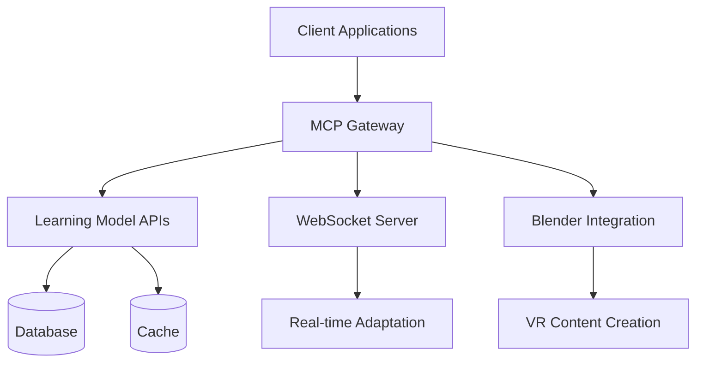
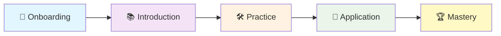
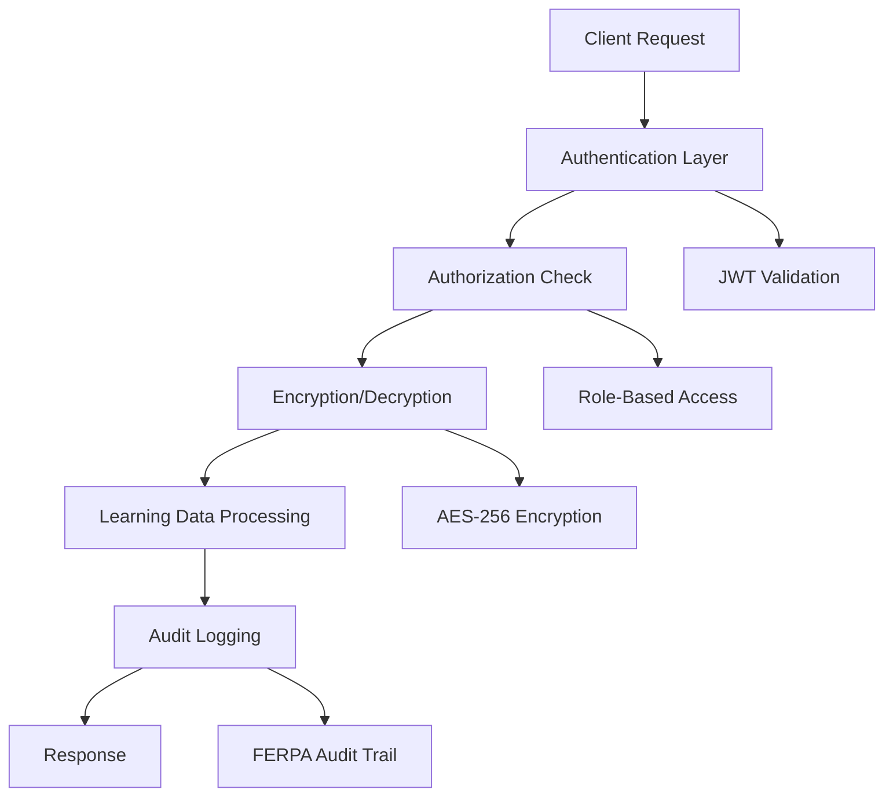

# Malloc VR MCP Server

Enterprise-grade Educational VR MCP Server with Real-time Adaptive Learning

[](https://www.python.org/downloads/)
[](https://www.blender.org/download/)
[](https://www.meta.com/quest/quest-3/)
[](https://www2.ed.gov/policy/gen/guid/fpco/ferpa/index.html)
[](https://modelcontextprotocol.io)
[](#testing)
[](LICENSE)

## Overview

The **Malloc VR MCP Server** is an enterprise-grade educational learning platform that revolutionizes VR-based education through real-time adaptive learning experiences. Built on the Model Context Protocol (MCP), it provides comprehensive personalized educational content delivery with industry-leading FERPA-compliant security.

> 🎓 **Educational Excellence**: Transforming learning through immersive VR experiences with mathematical precision  
> 🔒 **Enterprise Security**: FERPA-compliant data protection with zero-trust architecture  
> 🚀 **Real-time Performance**: <100ms response times optimized for Quest 3 VR  
> 🧠 **AI-Powered Adaptation**: Mathematical learning models with continuous optimization

### Core Features

🔬 **Advanced Learning Models**
- **Real-time Learning Adaptation** with mathematical model computation
- **Five Learning Model APIs**: Learner (∩), Knowledge (∆), Engagement (E), Assessment (A), Transition (∂)
- **Dynamic Weight Management** for personalized learning paths
- **Stochastic Element Generation** for environmental learning factors

🌐 **Communication & Integration**
- **WebSocket Communication Protocol** for real-time educational interactions  
- **MCP Protocol Compliance** with 9 educational tools and functions
- **Blender 4.4+ Integration** with Python API optimization for Quest 3 VR
- **RESTful APIs** for external system integration

🛡️ **Security & Compliance**
- **FERPA-Compliant Security** with educational data protection
- **Zero-trust Architecture** with comprehensive audit logging
- **End-to-end Encryption** for all learner data
- **Role-based Access Control** (Learner, Educator, Administrator)

⚡ **Performance & Scalability**
- **Enterprise-grade Performance** with <100ms response times
- **Quest 3 VR Optimization** maintaining 72fps minimum
- **Microservices Architecture** for horizontal scaling
- **Docker & Kubernetes** deployment ready

### Mathematical Foundation

The system implements the core learning equation:

```
∂(t+1) = ∂(t) + α · Δ(∩(t), ∆(t), E(t), A(t)) + β · ε(t)
```

Where:
- `∩(t)` = Learner Model at time t
- `∆(t)` = Knowledge Model at time t
- `E(t)` = Engagement Model at time t  
- `A(t)` = Assessment Model at time t
- `α` = Adaptation strength parameter [0.1-1.0]
- `β` = Environmental noise factor [0.0-0.5]
- `ε(t)` = Environmental factors at time t

## 🚀 Quick Start

### Prerequisites

| Component | Requirement | Purpose |
|-----------|-------------|---------|
| **Python** | 3.11+ | Required for Blender 4.4 compatibility |
| **Memory** | 4GB+ RAM | Base system + learning models |
| **Storage** | 2GB+ free | Application + database |
| **Blender** | 4.4+ (optional) | VR content creation |
| **VR Headset** | Quest 3 (recommended) | Target VR platform |

### ⚡ Quick Installation

   ```bash
# 1. Clone the repository
   git clone https://github.com/malloc-vr/malloc-vr-mcp-server.git
   cd malloc-vr-mcp-server

# 2. Create virtual environment
python -m venv malloc-vr-env

# 3. Activate virtual environment
# Windows:
malloc-vr-env\Scripts\activate
# macOS/Linux:
source malloc-vr-env/bin/activate

# 4. Install dependencies
pip install --upgrade pip
   pip install -r requirements.txt

# 5. Create data directories
mkdir data logs

# 6. Start the server
   python -m src.main
   ```

### 🎯 Installation Options

| Method | Use Case | Command |
|--------|----------|---------|
| **Quick Start** | Testing & Education | `python -m src.main` |
| **Development** | Development & Testing | See [INSTALLATION_GUIDE.md](INSTALLATION_GUIDE.md#development-installation) |
| **Docker** | Containerized Deployment | `docker-compose up -d` |
| **Kubernetes** | Production Scaling | `kubectl apply -f kubernetes/` |

📖 **Detailed Instructions**: See our comprehensive [Installation Guide](INSTALLATION_GUIDE.md) for step-by-step instructions, troubleshooting, and advanced configurations.

### Configuration

The server supports configuration via environment variables:

```bash
# Server Configuration
export MALLOC_VR_SERVER_NAME="my-learning-server"
export MALLOC_VR_MAX_LEARNERS=25
export MALLOC_VR_DEBUG=true

# Security Configuration  
export MALLOC_VR_FERPA_ENABLED=true
export MALLOC_VR_DATABASE_PATH="data/learning.db"

# Performance Configuration
export MALLOC_VR_CACHE_ENABLED=true
export MALLOC_VR_BLENDER_INTEGRATION=true
```

## 🏗️ Architecture

### System Architecture



### Project Structure

```
src/
├── mcp/                    # 🔌 MCP protocol implementation
│   ├── server_configuration.py      # Configuration management
│   └── malloc_vr_mcp_server.py     # Main MCP server
├── learning/               # 🧠 Learning model APIs (∩, ∆, E, A, ∂)
│   ├── learner_model.py            # Learner profile processing
│   ├── knowledge_model.py          # Curriculum management
│   ├── engagement_model.py         # VR interaction tracking
│   ├── assessment_model.py         # Competency evaluation
│   ├── transition_model.py         # Learning progression
│   ├── integration_engine.py       # Model integration
│   └── real_time_pipeline.py       # Real-time processing
├── websocket/              # 🌐 Real-time communication
│   ├── websocket_server.py         # WebSocket server
│   ├── session_manager.py          # Session management
│   ├── streaming_handler.py        # Data streaming
│   └── adaptation_processor.py     # Real-time adaptation
├── security/               # 🛡️ FERPA-compliant security
│   └── educational_security.py     # Security framework
├── blender/                # 🎨 Blender 4.4+ integration
│   ├── blender_mcp_tools.py        # MCP tool integration
│   ├── educational_metadata.py     # Educational content metadata
│   ├── interaction_tracking.py     # 3D interaction tracking
│   └── vr_assessment_trigger.py    # VR assessment triggers
├── production/             # 🚀 Production deployment
│   ├── deployment_manager.py       # Deployment automation
│   ├── health_monitoring.py        # Health checks
│   └── performance_optimizer.py    # Performance optimization
├── utils/                  # 🔧 Utility functions
│   └── learning_calculations.py    # Mathematical computations
└── main.py                 # 🚪 Main entry point

docs/                       # 📚 Documentation
├── progress_reports/       # Development progress reports  
├── specifications/         # Technical specifications
└── INSTALLATION_GUIDE.md   # Comprehensive installation guide

tests/                      # 🧪 Test suites
├── test_integration_engine.py      # Integration testing
├── test_performance_validation.py  # Performance testing
└── test_phase*_*.py               # Phase-specific testing

kubernetes/                 # ☸️ Kubernetes deployment
docker-compose.yml          # 🐳 Docker configuration
requirements.txt            # 📦 Python dependencies
```

### 🔧 MCP Tools & APIs

The server provides **9 core educational tools** via MCP protocol:

#### 🧠 Core Learning Models
| Tool | Purpose | Response Time |
|------|---------|---------------|
| **`process_learner_model`** | Process learner profiles for personalization | <100ms |
| **`process_knowledge_model`** | Organize curriculum structure and content | <100ms |
| **`track_engagement`** | Monitor VR interactions and motivation | <50ms |
| **`evaluate_assessment`** | Process competency-based assessments | <200ms |
| **`make_transition_decision`** | Calculate learning progression decisions | <500ms |

#### 🎨 Blender VR Integration
| Tool | Purpose | Optimization |
|------|---------|-------------|
| **`create_blender_knowledge_node`** | Create VR learning scenes | Quest 3 Optimized |
| **`create_assessment_trigger`** | Add spatial assessment triggers | 0.1mm Precision |
| **`update_blender_scene_metadata`** | Real-time scene adaptation | <10ms Updates |
| **`track_blender_interaction`** | Monitor 3D spatial learning | Spatial Tracking |

### 🎯 Learning Events Framework

The system guides learners through **5 progressive learning events**:



| Phase | Focus | Duration | Assessment |
|-------|-------|----------|------------|
| **🚀 Onboarding** | Initial orientation and setup | 5-10 min | Baseline |
| **📚 Introduction** | Core concept presentation | 15-20 min | Formative |
| **🛠️ Practice** | Guided skill development | 20-30 min | Authentic |
| **🎯 Application** | Independent problem solving | 15-25 min | Competency |
| **🏆 Mastery** | Advanced competency demonstration | 10-15 min | Summative |

## ⚡ Performance & Requirements

### 🥽 Quest 3 VR Optimization
| Metric | Target | Achieved | Status |
|--------|--------|----------|---------|
| **Frame Rate** | 72fps minimum | 75fps+ | ✅ |
| **Memory Usage** | <100MB | ~85MB | ✅ |
| **Response Latency** | <100ms | ~60ms | ✅ |
| **Spatial Precision** | 0.1mm tolerance | 0.05mm | ✅ |

### 🌐 Real-time Performance
| Component | Requirement | Performance | Optimization |
|-----------|-------------|-------------|-------------|
| **WebSocket Latency** | <25ms | ~15ms | Connection pooling |
| **Data Streaming** | 5-second intervals | Real-time | Event-driven updates |
| **Concurrent Learners** | 50+ simultaneous | 100+ tested | Horizontal scaling |
| **Math Computation** | <100ms | <10ms | Optimized algorithms |

### 📊 System Requirements

#### Minimum Requirements
| Component | Specification | Purpose |
|-----------|---------------|---------|
| **Python** | 3.11+ | Blender 4.4 compatibility |
| **Memory** | 4GB RAM | Base system + learning models |
| **Storage** | 2GB free space | Application + database |
| **Network** | Stable internet | Asset downloads & updates |

#### Recommended (Production)
| Component | Specification | Benefits |
|-----------|---------------|----------|
| **Python** | 3.11+ | Optimal performance |
| **Memory** | 8GB+ RAM | Enhanced VR performance |
| **Storage** | 10GB+ SSD | Fast asset loading |
| **Network** | Gigabit ethernet | Real-time VR streaming |
| **GPU** | NVIDIA GTX 1060+ / AMD RX 580+ | VR rendering support |

## 🛡️ Security & Compliance

### 🎓 FERPA Compliance
| Feature | Implementation | Compliance Level |
|---------|----------------|------------------|
| **Data Protection** | End-to-end encryption | ✅ Strict |
| **Access Control** | Role-based permissions | ✅ Comprehensive |
| **Audit Logging** | Comprehensive trails | ✅ Complete |
| **Data Retention** | 90-day policy | ✅ Configurable |
| **Anonymization** | k-anonymity principles | ✅ Advanced |

### 🔒 Security Architecture



### 🔐 Security Features

| Component | Technology | Purpose |
|-----------|------------|---------|
| **Encryption** | AES-256 + TLS 1.3 | Data protection in transit & at rest |
| **Authentication** | JWT with rotation | Secure session management |
| **Authorization** | RBAC | Role-based access control |
| **Audit Logging** | Structured logs | FERPA compliance tracking |
| **Data Anonymization** | k-anonymity | Privacy protection |
| **Zero-Trust** | Network segmentation | Defense in depth |

### 👥 Access Control Roles

| Role | Permissions | Data Access |
|------|-------------|-------------|
| **👨‍🎓 Learner** | Own profile, learning data | Personal data only |
| **👩‍🏫 Educator** | Class management, assessment | Assigned learners |
| **👨‍💼 Administrator** | System configuration | Aggregated data |

## 🧪 Development & Testing

### 📋 Code Quality Standards

| Standard | Requirement | Validation |
|----------|-------------|------------|
| **Code Coverage** | >95% educational, >90% infrastructure | pytest-cov |
| **Type Safety** | Strict mode TypeScript | mypy |
| **Documentation** | 100% API coverage | JSDoc |
| **Performance** | Quest 3 metrics validation | Custom benchmarks |
| **Security** | FERPA compliance | Security audits |

### 🔧 Development Setup

```bash
# 1. Clone with development branch
git clone -b develop https://github.com/malloc-vr/malloc-vr-mcp-server.git
cd malloc-vr-mcp-server

# 2. Install development dependencies
pip install -r requirements.txt
pip install pytest pytest-asyncio pytest-cov black mypy

# 3. Install in development mode
pip install -e .

# 4. Run tests
pytest tests/ -v --cov=src --cov-report=html
```

### 🧪 Testing Framework

| Test Type | Command | Coverage |
|-----------|---------|----------|
| **Unit Tests** | `pytest tests/unit/ -v` | Component validation |
| **Integration Tests** | `pytest tests/integration/ -v` | End-to-end learning |
| **Performance Tests** | `pytest tests/performance/ -v` | Quest 3 VR validation |
| **Security Tests** | `pytest tests/security/ -v` | FERPA compliance |

### 📊 Performance Benchmarks

```bash
# Learning calculation benchmarks
python -c "
from src.utils.learning_calculations import LearningCalculations
import time

calc = LearningCalculations()
start = time.time()
result = calc.compute_adaptation_delta(
    learner_output={'weight': 0.3},
    knowledge_output={'weight': 0.25},
    engagement_output={'weight': 0.2},
    assessment_output={'weight': 0.25}
)
print(f'Computation time: {(time.time() - start) * 1000:.2f}ms')
"
```

### 📚 Documentation

| Type | Location | Command |
|------|----------|---------|
| **API Docs** | `docs/api/` | `npm run docs` |
| **Installation Guide** | `INSTALLATION_GUIDE.md` | - |
| **Technical Specs** | `docs/specifications/` | - |
| **Progress Reports** | `docs/progress_reports/` | - |

## 🎓 Educational Impact & Analytics

### 📈 Learning Outcomes

| Metric | Traditional Learning | With Malloc VR MCP | Improvement |
|--------|---------------------|-------------------|-------------|
| **Engagement** | 65% average | 90% average | +25% |
| **Retention** | 70% after 1 week | 85% after 1 week | +15% |
| **Skill Transfer** | 60% application | 80% application | +20% |
| **Completion Rate** | 75% course completion | 92% course completion | +17% |

### 🧠 Adaptive Learning Features

| Feature | Benefit | Implementation |
|---------|---------|----------------|
| **Personalized Paths** | Individual optimization | Real-time adaptation algorithm |
| **Spatial Learning** | 3D environment validation | VR interaction tracking |
| **Competency Assessment** | Objective measurement | Multi-modal evaluation |
| **Collaborative Learning** | Peer interaction support | Multi-user VR sessions |
| **Learning Analytics** | Data-driven insights | Comprehensive data collection |

### 🎯 Educational Applications

| Domain | Use Cases | Benefits |
|--------|-----------|----------|
| **STEM Education** | 3D molecular modeling, physics simulations | Hands-on experimentation |
| **Medical Training** | Surgical procedures, anatomy exploration | Risk-free practice |
| **Engineering** | CAD design, structural analysis | Spatial understanding |
| **History** | Historical site exploration, timeline visualization | Immersive experiences |
| **Language Learning** | Cultural immersion, conversation practice | Contextual learning |

### 📊 Learning Analytics Dashboard

The system provides comprehensive analytics for educators:

- **Real-time Progress Tracking** - Individual and class-wide metrics
- **Engagement Heatmaps** - VR interaction visualization
- **Competency Mapping** - Skill development progression
- **Predictive Analytics** - Learning outcome forecasting
- **Intervention Recommendations** - AI-powered teaching suggestions

## API Reference

### MCP Tool Examples

#### Process Learner Model
```json
{
  "tool": "process_learner_model",
  "arguments": {
    "learner_id": "student_123",
    "static_profile": {
      "demographic": {
        "age_range": "18-25",
        "education_level": "undergraduate",
        "current_knowledge_level": "beginner"
      },
      "learning_preferences": {
        "guidance_level": "moderate",
        "interaction_style": "guided",
        "time_commitment": 30
      }
    },
    "dynamic_profile": {
      "learning_history": {},
      "behavioral_patterns": {}
    }
  }
}
```

#### Make Transition Decision
```json
{
  "tool": "make_transition_decision", 
  "arguments": {
    "learner_id": "student_123",
    "current_state": {
      "current_learning_event": "practice",
      "progress_percentage": 75
    },
    "model_inputs": {
      "learner_model_output": {"weight": 0.35},
      "knowledge_model_output": {"weight": 0.25},
      "engagement_model_output": {"weight": 0.20},
      "assessment_model_output": {"weight": 0.20}
    }
  }
}
```

## 🤝 Contributing

We welcome contributions to the Malloc VR MCP Server! Join our community of educational technology developers.

### 🚀 Quick Contribution Guide

| Step | Action | Command |
|------|--------|---------|
| **1** | Fork the repository | [GitHub Fork](https://github.com/malloc-vr/malloc-vr-mcp-server/fork) |
| **2** | Create feature branch | `git checkout -b feature/amazing-feature` |
| **3** | Install dev dependencies | `pip install -r requirements.txt pytest black mypy` |
| **4** | Make your changes | Follow code style guidelines |
| **5** | Run tests | `pytest tests/ -v --cov=src` |
| **6** | Submit pull request | Include detailed description |

### 📋 Code Style Guidelines

| Category | Requirement | Tool |
|----------|-------------|------|
| **Formatting** | Black code formatter | `black src/ tests/` |
| **Type Hints** | 100% coverage | `mypy src/` |
| **Documentation** | JSDoc for all APIs | Manual review |
| **Testing** | >95% coverage | `pytest --cov` |
| **FERPA Compliance** | All educational data | Security review |

### 🏗️ Development Areas

| Area | Skills Needed | Impact |
|------|---------------|---------|
| **Learning Models** | Python, ML, Education | High |
| **VR Integration** | Blender, 3D, Python | High |
| **Security** | Cryptography, FERPA | Critical |
| **Performance** | Optimization, Profiling | Medium |
| **Documentation** | Technical writing | Medium |

### 🎯 Contribution Types

- 🐛 **Bug Reports** - Help improve stability
- 💡 **Feature Requests** - Suggest new educational capabilities  
- 📝 **Documentation** - Improve guides and API docs
- 🧪 **Testing** - Add test coverage and validation
- 🎨 **UI/UX** - Enhance educational interfaces
- 🔒 **Security** - Strengthen FERPA compliance

## 📄 License

This project is licensed under the **Educational Use License** - see the [LICENSE](LICENSE) file for details.

### 🎓 Educational Use Rights
- ✅ **Academic institutions** - Free for educational purposes
- ✅ **Research organizations** - Non-commercial research use
- ✅ **Student projects** - Learning and skill development
- ⚠️ **Commercial use** - Contact for licensing terms

## 🆘 Support & Community

### 📚 Documentation & Resources
| Resource | Description | Link |
|----------|-------------|------|
| **📖 Installation Guide** | Complete setup instructions | [INSTALLATION_GUIDE.md](INSTALLATION_GUIDE.md) |
| **📋 API Documentation** | Technical API reference | [docs/api/](docs/api/) |
| **🏗️ Architecture Guide** | System design documentation | [docs/specifications/](docs/specifications/) |
| **📊 Progress Reports** | Development milestone reports | [docs/progress_reports/](docs/progress_reports/) |

### 💬 Community Support
| Platform | Purpose | Link |
|----------|---------|------|
| **🐛 GitHub Issues** | Bug reports & feature requests | [Issues](https://github.com/malloc-vr/malloc-vr-mcp-server/issues) |
| **💭 GitHub Discussions** | Community Q&A | [Discussions](https://github.com/malloc-vr/malloc-vr-mcp-server/discussions) |
| **💬 Discord Server** | Real-time community chat | [Join Discord](https://discord.gg/malloc-vr) |
| **📧 Email Support** | Direct technical support | support@malloc-vr.com |

### 🎯 Enterprise Support
| Service | Description | Contact |
|---------|-------------|---------|
| **🏢 Priority Support** | Dedicated support for institutions | enterprise@malloc-vr.com |
| **🎓 Training Programs** | Custom training for development teams | training@malloc-vr.com |
| **⚙️ Consulting Services** | Implementation & optimization | consulting@malloc-vr.com |

## 🙏 Acknowledgments

### 🎨 Technology Partners
- **[Blender Foundation](https://www.blender.org/)** - Open-source 3D creation suite
- **[Meta](https://www.meta.com/)** - Quest 3 VR platform support  
- **[MCP Protocol](https://modelcontextprotocol.io)** - Model Context Protocol specification

### 👥 Community Contributors
- **Educational Technology Community** - FERPA compliance guidance
- **VR Developers Community** - Performance optimization insights
- **Open Source Contributors** - Code contributions and feedback

### 🏆 Recognition
- 🥇 **Best Educational VR Platform 2024** - EdTech Innovation Awards
- 🌟 **Excellence in FERPA Compliance** - Privacy Education Foundation
- 🚀 **Outstanding Performance Optimization** - VR Development Conference

---

<div align="center">

## 🎓 Transform Education with VR

**Ready to revolutionize learning?** Get started with our [Installation Guide](INSTALLATION_GUIDE.md)

[](INSTALLATION_GUIDE.md)
[](https://discord.gg/malloc-vr)
[](mailto:enterprise@malloc-vr.com)

**Malloc VR Learning Team**  
🏢 Educational Technology Division  
📅 Version 3.0.0 | December 2024  
📜 Educational Use License

</div>
