# Elite VR Learning Experience MCP: Comprehensive System Documentation

**Product Requirements & Design Document for Sethu Nguna**

**Version:** 3.0  
**Last Updated:** August 30, 2025  
**Document Type:** Enterprise-Grade System Documentation with Vibe-Coding Development Methodology  
**Target Audience:** 99th Percentile MCP Developer with 20+ Years Experience

---

## Executive Summary

The Elite VR Learning Experience Model Context Protocol (MCP) transforms Sethu Nguna's personal Windows workstation into an integrated, AI-powered educational VR creation ecosystem specifically optimized for developing learning simulations and educational games targeting Meta Quest 3 and higher-generation standalone VR headsets.

This enterprise-grade system unifies Blender 4.4 LTS, Unity 6.2 LTS, and Cursor AI with Claude 3.5 Sonnet into a seamless educational content development environment that produces pedagogically sound, engaging VR learning experiences while leveraging advanced AI assistance and comprehensive development methodologies.

### Mission Statement

This system implements a comprehensive **"Pedagogy First"** development philosophy, ensuring that all technical features directly serve the goal of creating effective, measurable learning outcomes through enterprise-grade development practices and AI-enhanced workflows.

### Educational Vision Statement

Understanding that educational VR represents a fundamentally different design challenge than commercial entertainment, this MCP system is engineered specifically to support learning theory application, assessment integration, and pedagogical effectiveness measurement within VR environments. The system recognizes that Quest 3's accessibility and standalone nature makes it ideal for deploying immersive learning experiences across diverse educational settings.

The system facilitates a simulation-based methodology aligning with key constructivist and experiential learning frameworks:

- **Situated Learning Theory** (Lave & Wenger, 1991): Immersing learners in authentic, context-rich virtual environments where knowledge is co-constructed through active participation
- **Self-Determination Theory** (Ryan & Deci, 2000): Fostering intrinsic motivation by supporting learner autonomy, competence, and relatedness  
- **Embodied Cognition** (Wilson, 2002): Creating experiences where learning is achieved through physical action and interaction, deeply integrating cognitive processes with sensory and motor experiences

---

## Table of Contents

1. [Vibe-Coding Development Methodology](#vibe-coding-development-methodology)
2. [System Architecture & MCP Protocol Integration](#system-architecture--mcp-protocol-integration)
3. [Cursor AI Configuration & Development Rules](#cursor-ai-configuration--development-rules)
4. [Hierarchical Development Structure](#hierarchical-development-structure)
5. [Technical Specifications & Implementation](#technical-specifications--implementation)
6. [Educational Design Framework](#educational-design-framework)
7. [Enterprise Development Workflow](#enterprise-development-workflow)
8. [Performance Optimization & Quest 3 Targeting](#performance-optimization--quest-3-targeting)
9. [Assessment & Analytics Engine](#assessment--analytics-engine)
10. [Quality Assurance & Testing Framework](#quality-assurance--testing-framework)
11. [Implementation Phases & Detailed Roadmap](#implementation-phases--detailed-roadmap)
12. [Future Roadmap & Enterprise Integration](#future-roadmap--enterprise-integration)

---

## Vibe-Coding Development Methodology

### RADAR Process Logic Integration

The Elite VR Learning MCP system implements a comprehensive **RADAR Development Process** that ensures enterprise-grade quality while maintaining rapid AI-assisted development capabilities.

```mermaid
flowchart TD
    A[📖 READ: Documentation Analysis] --> B[📋 AUDIT: Current State Assessment]
    B --> C[🎯 DESIGN: Action Plan Creation]
    C --> D[⚡ ACT: Granular Implementation]
    D --> E[📊 REPORT: Progress Analysis]
    E --> F[🔄 Next Step/Phase/Stage]
    F --> A
    
    style A fill:#e1f5fe
    style B fill:#f3e5f5
    style C fill:#fff3e0
    style D fill:#e8f5e8
    style E fill:#fce4ec
```



#### RADAR Methodology Implementation

```python
class MCPDevelopmentRADAR:
    """
    Enterprise-grade RADAR methodology for MCP development
    Designed for 99th percentile developers with 20+ years experience
    """
    
    def __init__(self, project_config: Dict[str, Any]):
        self.project_root = project_config.get("project_root", os.getcwd())
        self.ai_model = "claude-3.5-sonnet-20240620"
        self.context_strategy = "comprehensive"
        self.quality_standards = "enterprise_grade"
        
    def execute_development_step(self, stage: str, phase: str, step: str, prompt: str) -> Dict:
        """
        Execute a single development step using RADAR methodology
        with comprehensive validation and reporting
        """
        
        # READ: Granular documentation analysis
        context = self.read_documentation_granular()
        
        # AUDIT: Comprehensive project state assessment
        audit_report = self.audit_project_comprehensive()
        
        # DESIGN: Create detailed action plan
        action_plan = self.design_action_plan_detailed(prompt, audit_report, context)
        
        # ACT: Implement with continuous validation
        implementation_results = self.implement_with_validation(action_plan)
        
        # REPORT: Generate comprehensive progress report
        progress_report = self.generate_comprehensive_report(
            stage, phase, step, audit_report, implementation_results
        )
        
        return {
            "stage": stage,
            "phase": phase,
            "step": step,
            "success_rate": implementation_results.get("success_rate", 0.0),
            "quality_metrics": implementation_results.get("quality_metrics", {}),
            "educational_effectiveness": implementation_results.get("educational_metrics", {}),
            "quest_3_performance": implementation_results.get("performance_metrics", {}),
            "progress_report": progress_report
        }
    
    def read_documentation_granular(self) -> Dict[str, Any]:
        """
        Comprehensive documentation analysis with educational VR context
        """
        return {
            "system_requirements": self.parse_system_requirements(),
            "educational_objectives": self.parse_educational_objectives(),
            "technical_architecture": self.parse_architecture_specs(),
            "mcp_protocol_specs": self.parse_mcp_specifications(),
            "performance_targets": self.parse_quest_3_requirements(),
            "pedagogical_frameworks": self.parse_learning_theories(),
            "existing_codebase": self.analyze_existing_implementation(),
            "dependency_mapping": self.analyze_dependencies(),
            "quality_standards": self.parse_quality_requirements()
        }
    
    def audit_project_comprehensive(self) -> Dict[str, Any]:
        """
        Comprehensive project state audit with educational VR focus
        """
        return {
            "file_system_analysis": self.audit_file_structure(),
            "code_quality_metrics": self.analyze_code_quality(),
            "educational_components": self.audit_educational_features(),
            "mcp_protocol_compliance": self.validate_mcp_compliance(),
            "performance_benchmarks": self.measure_quest_3_performance(),
            "testing_coverage": self.analyze_test_coverage(),
            "documentation_completeness": self.audit_documentation(),
            "technical_debt_assessment": self.assess_technical_debt(),
            "security_compliance": self.audit_security_standards()
        }
```

### Enterprise Development Standards

#### Core Development Principles

```yaml
# Elite VR Learning MCP Development Standards
enterprise_standards:
  code_quality:
    - "Follow SOLID principles religiously"
    - "Implement comprehensive error handling"
    - "Maintain 90%+ test coverage for critical paths"
    - "Use dependency injection for major components"
    - "Document all public interfaces with XML documentation"
  
  performance_requirements:
    - "Target 72-90 FPS on Quest 3"
    - "Memory usage under 8GB for development tools"
    - "Asset optimization must be automated"
    - "VR interactions must have <20ms latency"
  
  educational_focus:
    - "Preserve pedagogical effectiveness in all optimizations"
    - "Maintain learning objective traceability"
    - "Implement comprehensive educational analytics"
    - "Support diverse learning styles and accessibility needs"
  
  mcp_protocol_compliance:
    - "All tool interfaces must implement MCP schema"
    - "Context passing must be stateful and consistent"
    - "Error responses must follow MCP error format"
    - "Version compatibility must be maintained"
```

---

## System Architecture & MCP Protocol Integration

### High-Level MCP Architecture


### MCP Protocol Implementation Details

#### Core MCP Server Architecture

```typescript
interface MCPServerConfig {
  name: "elite-vr-learning-mcp";
  version: "3.0.0";
  protocol_version: "2024-11-05";
  capabilities: {
    tools: {
      listChanged?: boolean;
    };
    resources: {
      subscribe?: boolean;
      listChanged?: boolean;
    };
    prompts: {
      listChanged?: boolean;
    };
    logging?: {};
  };
  educational_extensions: {
    pedagogical_analysis: boolean;
    learning_objective_tracking: boolean;
    quest_3_optimization: boolean;
    xapi_integration: boolean;
  };
}

class EliteVRLearningMCPServer implements MCPServer {
  private toolRegistry: EducationalToolRegistry;
  private contextManager: PedagogicalContextManager;
  private performanceMonitor: Quest3PerformanceMonitor;
  private analyticsEngine: EducationalAnalyticsEngine;
  
  constructor(config: MCPServerConfig) {
    this.initializeEducationalMCPServer(config);
  }
  
  async initialize(): Promise<void> {
    // Initialize MCP server with educational VR specializations
    await this.setupEducationalToolRegistry();
    await this.initializePedagogicalContextManager();
    await this.startQuest3PerformanceMonitoring();
    await this.enableEducationalAnalytics();
  }
  
  async handleToolCall(request: ToolCallRequest): Promise<ToolCallResult> {
    const context = await this.contextManager.getEducationalContext(request);
    const tool = await this.toolRegistry.getTool(request.name);
    
    // Validate educational appropriateness
    const validation = await this.validateEducationalContent(request, context);
    if (!validation.isValid) {
      throw new MCPError(`Educational validation failed: ${validation.reason}`);
    }
    
    // Execute with performance monitoring
    const startTime = performance.now();
    const result = await tool.execute(request.arguments, context);
    const executionTime = performance.now() - startTime;
    
    // Track educational analytics
    await this.analyticsEngine.recordToolUsage({
      tool: request.name,
      context: context,
      result: result,
      performance: { executionTime },
      educational_impact: await this.assessEducationalImpact(result, context)
    });
    
    return result;
  }
}
```

#### Educational Tool Registry

```typescript
class EducationalToolRegistry implements ToolRegistry {
  private tools: Map<string, EducationalTool> = new Map();
  
  async registerEducationalTools(): Promise<void> {
    // Blender Integration Tools
    this.registerTool(new BlenderAssetCreationTool());
    this.registerTool(new BlenderUSDExportTool());
    this.registerTool(new BlenderAIArtGenerationTool());
    this.registerTool(new BlenderEducationalOptimizationTool());
    
    // Unity Integration Tools  
    this.registerTool(new UnitySceneSetupTool());
    this.registerTool(new UnityXRConfigurationTool());
    this.registerTool(new UnityPedagogicalTemplateTool());
    this.registerTool(new UnityQuest3BuildTool());
    
    // Educational Analytics Tools
    this.registerTool(new LearningAnalyticsTool());
    this.registerTool(new PedagogicalAssessmentTool());
    this.registerTool(new EducationalContentValidationTool());
    
    // Performance Optimization Tools
    this.registerTool(new Quest3OptimizationTool());
    this.registerTool(new VRPerformanceProfilerTool());
    this.registerTool(new EducationalAssetOptimizerTool());
  }
  
  private registerTool(tool: EducationalTool): void {
    // Validate tool meets educational VR requirements
    this.validateEducationalTool(tool);
    
    // Register with MCP protocol compliance
    this.tools.set(tool.name, tool);
    
    // Setup educational context integration
    tool.setEducationalContext(this.getEducationalContext());
  }
}
```

---

## Cursor AI Configuration & Development Rules

### Enterprise-Grade Cursor Configuration

#### .cursorrules Configuration File

```yaml
# Elite VR Learning MCP Development Rules
# For 99th Percentile MCP Developer with 20+ Years Experience
# Version: 3.0 | Updated: August 30, 2025

## Core Development Philosophy
development_philosophy: |
  "Pedagogy First" - Every technical decision must enhance educational effectiveness
  "Quest 3 Optimized" - All code must consider VR performance implications
  "MCP Compliant" - Strict adherence to Model Context Protocol standards
  "Enterprise Quality" - Production-ready code with comprehensive testing

## AI Model Configuration
ai_model: "claude-3.5-sonnet-20240620"
context_strategy: "comprehensive_educational_vr"
code_style: "enterprise_grade_with_educational_focus"
documentation_level: "exhaustive_with_pedagogical_context"

## Core Development Principles
principles:
  mcp_compliance:
    - "ALWAYS follow MCP (Model Context Protocol) standards"
    - "NEVER break existing MCP functionality without explicit approval"
    - "ALWAYS implement proper MCP error handling and responses"
    - "ALWAYS maintain MCP protocol versioning compatibility"
  
  educational_focus:
    - "ALWAYS preserve pedagogical effectiveness in technical decisions"
    - "ALWAYS consider learning objective impact in code changes"
    - "ALWAYS implement comprehensive educational analytics tracking"
    - "ALWAYS maintain accessibility for diverse learning needs"
  
  vr_performance:
    - "ALWAYS consider Quest 3 performance implications (72-90 FPS target)"
    - "ALWAYS implement VR-optimized rendering and interaction patterns"
    - "ALWAYS validate memory usage for extended VR learning sessions"
    - "ALWAYS ensure VR interactions have <20ms latency"
  
  code_quality:
    - "ALWAYS write self-documenting code with comprehensive XML documentation"
    - "ALWAYS implement defensive programming practices"
    - "ALWAYS follow SOLID principles and dependency injection patterns"
    - "ALWAYS maintain 90%+ test coverage for critical educational paths"

## Language-Specific Standards
typescript_standards:
  style: "strict_enterprise_with_educational_types"
  patterns:
    - "Use strict TypeScript configuration with educational domain types"
    - "Implement comprehensive error handling with MCP error format"
    - "Use educational context interfaces throughout the codebase"
    - "Follow functional programming patterns for educational logic"
  
csharp_standards:
  style: "microsoft_conventions_with_unity_vr_optimization"
  patterns:
    - "Use XML documentation comments for all public members"
    - "Implement Unity-specific performance patterns for VR"
    - "Follow async/await patterns for MCP communication"
    - "Use dependency injection for educational component management"
  
python_standards:
  style: "pep8_with_comprehensive_type_hints_and_educational_context"
  patterns:
    - "Use comprehensive type hints with educational domain types"
    - "Implement dataclasses for educational data structures"
    - "Follow async patterns for Blender integration"
    - "Use context managers for resource management in VR workflows"

## Architecture Requirements
architecture_patterns:
  separation_of_concerns:
    - "Separate MCP protocol logic from educational business logic"
    - "Isolate VR rendering from educational content management"
    - "Maintain clear boundaries between Blender and Unity integrations"
  
  dependency_management:
    - "Use dependency injection containers for major components"
    - "Implement interface-based programming for educational tools"
    - "Maintain loose coupling between educational and technical systems"
  
  mcp_integration:
    - "All educational tools must implement MCP tool interface"
    - "Context passing must preserve educational metadata"
    - "State management must support educational workflow continuity"

## Performance Requirements
quest_3_optimization:
  frame_rate: "72-90 FPS sustained during educational VR experiences"
  memory_usage: "Optimize for Quest 3's 12GB RAM with educational content"
  loading_times: "Educational scene loading must be <5 seconds"
  interaction_latency: "VR educational interactions must have <20ms response"
  
development_performance:
  build_times: "Unity builds must complete within 2 minutes for iteration"
  blender_export: "Asset export pipeline must process typical educational assets <30 seconds"
  mcp_response_time: "MCP tool calls must respond within 1 second"

## Error Handling Standards
error_handling_patterns:
  mcp_compliance:
    - "All MCP errors must follow protocol error format specification"
    - "Implement proper error codes for educational workflow failures"
    - "Provide detailed error context for debugging educational content issues"
  
  educational_safety:
    - "Never crash educational VR experiences - implement graceful degradation"
    - "Preserve educational progress data even during system failures"
    - "Implement automatic recovery for common educational workflow errors"
  
  logging_standards:
    - "Log all educational interactions for analytics and debugging"
    - "Include performance metrics in VR interaction logs"
    - "Implement privacy-compliant logging for educational data"

## Testing Requirements
testing_coverage:
  unit_tests: "90%+ coverage for all educational logic and MCP protocol implementations"
  integration_tests: "100% coverage for Blender-Unity asset pipeline workflows"
  performance_tests: "All VR educational interactions must be performance tested on Quest 3"
  educational_validation: "All pedagogical templates must have educational effectiveness tests"

testing_patterns:
  mcp_testing:
    - "Mock MCP protocol interactions for unit testing"
    - "Test all MCP tool registrations and capability declarations"
    - "Validate MCP context passing and state management"
  
  vr_testing:
    - "Use Quest 3 simulator for automated VR interaction testing"
    - "Test educational VR scenarios with realistic user interaction patterns"
    - "Validate VR performance under various educational content loads"
  
  educational_testing:
    - "Test pedagogical effectiveness of educational templates"
    - "Validate learning analytics accuracy and completeness"
    - "Test accessibility features for diverse educational needs"

## File Organization Standards
project_structure: |
  elite_vr_learning_mcp/
  ├── docs/
  │   ├── architecture/           # System architecture documentation
  │   ├── educational_design/     # Pedagogical framework documentation  
  │   ├── api/                   # MCP API documentation
  │   └── user_guides/           # Educational content creator guides
  ├── src/
  │   ├── mcp_core/              # MCP protocol implementation
  │   │   ├── server/            # MCP server and tool registry
  │   │   ├── tools/             # Educational MCP tools
  │   │   └── context/           # Educational context management
  │   ├── blender_integration/   # Blender Python API integration
  │   │   ├── add_ons/           # Blender add-ons for educational VR
  │   │   ├── exporters/         # USD export and optimization
  │   │   └── ai_integration/    # AI art generation integration
  │   ├── unity_integration/     # Unity C# integration
  │   │   ├── editor_extensions/ # Unity editor tools
  │   │   ├── vr_frameworks/     # XR Interaction Toolkit integration
  │   │   ├── educational_templates/ # Pedagogical VR templates
  │   │   └── quest_3_optimization/  # Quest 3 specific optimizations
  │   ├── analytics_engine/      # Educational learning analytics
  │   │   ├── xapi_integration/  # Experience API implementation
  │   │   ├── data_collection/   # Learning data collection systems
  │   │   └── reporting/         # Educational analytics reporting
  │   └── shared/                # Shared utilities and types
  ├── tests/
  │   ├── unit/                  # Unit tests for all components
  │   ├── integration/           # Integration tests for workflows
  │   ├── performance/           # VR performance and Quest 3 testing
  │   └── educational/           # Pedagogical effectiveness testing
  ├── scripts/
  │   ├── build/                 # Build automation and CI/CD
  │   ├── deploy/                # Deployment and Quest 3 installation
  │   └── maintenance/           # System maintenance and monitoring
  └── assets/
      ├── educational_templates/ # Pedagogical content templates
      ├── quest_3_shaders/      # VR-optimized shaders
      └── sample_projects/       # Educational VR sample projects

## Git Workflow Standards
version_control:
  branch_naming: "feature/stage-phase-step-educational-description"
  commit_messages: |
    Format: "type(scope): educational impact description"
    
    Types: feat, fix, docs, style, refactor, test, chore, educational
    Scopes: mcp, blender, unity, analytics, vr, quest3, educational
    
    Examples:
    - "feat(mcp): implement educational tool registry with pedagogical metadata"
    - "fix(quest3): resolve VR performance regression in educational templates"
    - "educational(analytics): add xAPI integration for learning objective tracking"
  
  pull_request_requirements:
    - "All PRs must include educational impact assessment"
    - "Performance benchmarks must be included for VR-related changes"
    - "MCP protocol compliance validation must pass"
    - "Educational content validation must pass"
    - "Code review required from educational VR domain expert"

## Documentation Requirements
documentation_standards:
  code_documentation:
    - "Every public method must have comprehensive XML documentation"
    - "Include educational use case examples in API documentation"
    - "Document Quest 3 performance implications for VR methods"
    - "Include MCP protocol context in tool documentation"
  
  educational_documentation:
    - "Document pedagogical rationale for educational template designs"
    - "Include learning objective mappings for all educational components"
    - "Provide accessibility guidelines for educational VR content"
    - "Document educational analytics and assessment capabilities"
  
  auto_generation:
    - "API documentation must be auto-generated from code comments"
    - "Educational workflow documentation must be generated from template metadata"
    - "Performance benchmarks must be auto-documented from test results"

## Code Review Standards
review_checklist:
  technical_quality:
    - "Code follows SOLID principles and dependency injection patterns"
    - "All public interfaces have comprehensive documentation"
    - "Error handling follows MCP protocol standards"
    - "Performance considerations for Quest 3 VR are addressed"
  
  educational_effectiveness:
    - "Changes preserve or enhance pedagogical effectiveness"
    - "Learning objectives are clearly mapped and tracked"
    - "Educational accessibility requirements are met"
    - "Learning analytics integration is maintained"
  
  mcp_compliance:
    - "MCP protocol standards are strictly followed"
    - "Tool registrations and capabilities are properly declared"
    - "Context management preserves educational metadata"
    - "Error responses follow MCP error format specification"
```

### Cursor AI Integration Utilities

```typescript
// Cursor AI Integration for Educational VR Development
class CursorEducationalVRIntegration {
  private mcpServer: EliteVRLearningMCPServer;
  private educationalContext: PedagogicalContextManager;
  private performanceMonitor: Quest3PerformanceMonitor;
  
  constructor() {
    this.initializeEducationalAIAssistance();
  }
  
  async generateEducationalCode(
    prompt: string, 
    context: EducationalContext
  ): Promise<GeneratedCodeResult> {
    const enhancedPrompt = this.enhancePromptWithEducationalContext(prompt, context);
    
    const codeGeneration = await this.callCursorAPI({
      prompt: enhancedPrompt,
      context: {
        ...context,
        performance_targets: await this.getQuest3PerformanceTargets(),
        pedagogical_requirements: await this.getPedagogicalRequirements(context),
        mcp_compliance_rules: await this.getMCPComplianceRules()
      }
    });
    
    // Validate generated code for educational effectiveness and Quest 3 performance
    const validation = await this.validateGeneratedCode(codeGeneration);
    
    return {
      code: codeGeneration.code,
      educational_impact: validation.educationalImpact,
      performance_analysis: validation.quest3Performance,
      mcp_compliance: validation.mcpCompliance,
      suggestions: validation.improvementSuggestions
    };
  }
  
  private enhancePromptWithEducationalContext(
    prompt: string, 
    context: EducationalContext
  ): string {
    return `
    ${prompt}
    
    EDUCATIONAL VR DEVELOPMENT CONTEXT:
    Learning Objectives: ${context.learningObjectives.join(', ')}
    Target Audience: ${context.targetAudience}
    VR Platform: Meta Quest 3 (performance target: 72-90 FPS)
    Educational Framework: ${context.pedagogicalFramework}
    
    REQUIREMENTS:
    - Follow MCP (Model Context Protocol) standards strictly
    - Optimize for Quest 3 VR performance (12GB RAM, mobile GPU)
    - Preserve pedagogical effectiveness in all technical decisions
    - Implement comprehensive educational analytics tracking
    - Use enterprise-grade error handling and logging
    - Maintain 90%+ test coverage for educational logic
    - Follow SOLID principles and dependency injection
    
    EDUCATIONAL CONSIDERATIONS:
    - Ensure accessibility for diverse learning needs
    - Implement appropriate learning scaffolding
    - Support multiple learning modalities (visual, auditory, kinesthetic)
    - Include formative and summative assessment capabilities
    - Maintain learner engagement and motivation
    `;
  }
}
```

---

## Hierarchical Development Structure

### 5-Stage Development Architecture

The Elite VR Learning MCP system follows a comprehensive 5-stage development structure designed to ensure enterprise-grade quality while maintaining educational effectiveness and Quest 3 VR performance optimization.

#### **STAGE 1: Foundation Architecture** (Weeks 1-4)
*Establishing enterprise-grade MCP infrastructure and development environment*

##### **PHASE 1.1: Environment & Configuration Setup**
- **Step 1.1.1**: Project Structure & Repository Initialization
  - Enterprise-grade folder structure with MCP compliance
  - Git repository with semantic versioning and educational workflow branching
  - CI/CD pipeline templates with educational validation
- **Step 1.1.2**: Development Environment Configuration
  - Cursor AI with educational VR specialization
  - Python/Node.js environments with MCP dependencies
  - Unity 6.2 LTS and Blender 4.4 LTS configuration
- **Step 1.1.3**: MCP Protocol Core Implementation  
  - MCP server with educational VR tool registry
  - Context management for pedagogical workflows
  - Security and permission systems
- **Step 1.1.4**: Cursor AI Integration & Configuration
  - Advanced .cursorrules with educational focus
  - AI-assisted code generation with pedagogical awareness
  - Automated documentation and quality assurance

##### **PHASE 1.2: Core MCP Infrastructure**
- **Step 1.2.1**: MCP Server Architecture Implementation
  - Production-grade server with educational specializations
  - Middleware for authentication, logging, validation
  - Plugin architecture for educational capabilities
- **Step 1.2.2**: Tool Registration & Discovery System
  - Dynamic capability negotiation for educational tools
  - Version compatibility management
  - Health monitoring and lifecycle management
- **Step 1.2.3**: Context Management & State Persistence
  - Hierarchical context system (Project > Lesson > Activity)
  - Educational workflow state machines
  - Context sharing between Blender and Unity
- **Step 1.2.4**: Error Handling & Logging Framework
  - Structured logging with educational workflow context
  - Intelligent error recovery for VR development
  - Performance monitoring and alerting

##### **PHASE 1.3: Documentation & Testing Framework**
- **Step 1.3.1**: Automated Documentation Generation
  - API documentation with educational examples
  - Interactive documentation with VR workflow tutorials
  - Multi-format publishing (web, PDF, mobile)
- **Step 1.3.2**: Unit Testing Infrastructure
  - MCP protocol testing with educational scenarios
  - Property-based testing for educational algorithms
  - Parallel execution with context isolation
- **Step 1.3.3**: Integration Testing Framework
  - End-to-end educational workflow validation
  - Cross-system data integrity testing
  - VR deployment and validation automation
- **Step 1.3.4**: Performance Testing & Profiling
  - Quest 3 performance testing (72-90 FPS targets)
  - Memory usage and leak detection for VR
  - Educational content complexity analysis

#### **STAGE 2: Asset Pipeline Core** (Weeks 5-8)
*Building the Blender-Unity asset pipeline with Quest 3 optimization*

##### **PHASE 2.1: Blender Integration Layer**
- **Step 2.1.1**: Blender Python API Integration
  - Comprehensive API wrapper with educational VR focus
  - MCP tool registration for Blender capabilities
  - Educational asset management with metadata
- **Step 2.1.2**: USD Export Pipeline Implementation
  - Quest 3 performance optimization during export
  - Educational metadata preservation and transfer
  - Batch export for educational content libraries
- **Step 2.1.3**: Asset Optimization Engine
  - Intelligent polygon reduction with educational awareness
  - Texture optimization for Quest 3 mobile GPU
  - Automated LOD generation preserving recognizability
- **Step 2.1.4**: AI Art Generation Integration
  - Educational content prompting with appropriateness filters
  - Style consistency for educational VR environments
  - Content moderation and pedagogical validation

##### **PHASE 2.2: Unity Integration Layer**
- **Step 2.2.1**: Unity Editor Extension Framework
  - Modular educational tools with MCP integration
  - Pedagogical template management systems
  - Educational workflow automation and guidance
- **Step 2.2.2**: Asset Import & Processing Pipeline
  - USD asset import with educational metadata
  - Quest 3 optimization processing and validation
  - Asset dependency resolution and management
- **Step 2.2.3**: XR Interaction Toolkit Configuration
  - Quest 3 optimization with OpenXR backend
  - Educational interaction patterns and analytics
  - Accessibility configurations for diverse learners
- **Step 2.2.4**: Performance Optimization Systems
  - Real-time Quest 3 performance monitoring
  - Dynamic quality scaling for educational content
  - Memory management for extended VR sessions

##### **PHASE 2.3: Bi-directional Synchronization**
- **Step 2.3.1**: USD File Format Handler
  - Bi-directional sync with educational metadata
  - USD schema extensions for VR requirements
  - Change detection and synchronization triggers
- **Step 2.3.2**: Asset Metadata Management
  - Educational metadata schema for VR assets
  - Learning objective preservation systems
  - Cross-platform metadata synchronization
- **Step 2.3.3**: Change Detection & Sync Logic
  - Educational workflow-aware synchronization
  - Incremental sync for workflow efficiency
  - Change impact analysis for learning effectiveness
- **Step 2.3.4**: Conflict Resolution System
  - Educational priority-aware conflict resolution
  - Learning objective preservation during conflicts
  - Collaborative resolution for multi-educator scenarios

#### **STAGE 3: Educational VR Framework** (Weeks 9-12)
*Implementing pedagogical templates and learning interaction systems*

##### **PHASE 3.1: Pedagogical Template System**
- **Step 3.1.1**: Template Architecture & Base Classes
  - Modular template system with educational metadata
  - Learning objective integration and tracking
  - Accessibility and universal design compliance
- **Step 3.1.2**: Interactive Object Templates
  - VR interaction patterns for educational content
  - Gesture recognition and feedback systems
  - Progressive difficulty and scaffolding support
- **Step 3.1.3**: Assessment Component Templates
  - Formative and summative assessment integration
  - Real-time learning progress tracking
  - Adaptive assessment based on learner performance
- **Step 3.1.4**: Narrative & Dialogue Templates
  - Branching narrative for educational scenarios
  - AI-generated dialogue with pedagogical appropriateness
  - Cultural sensitivity and inclusive content validation

##### **PHASE 3.2: VR Interaction Framework**
- **Step 3.2.1**: Hand Tracking & Gesture Recognition
  - Quest 3 hand tracking for educational interactions
  - Gesture-based learning activities and assessment
  - Fine motor skill development and measurement
- **Step 3.2.2**: Spatial Interaction Components
  - 3D spatial learning environments
  - Object manipulation for educational concepts
  - Collaborative VR spaces for group learning
- **Step 3.2.3**: UI/UX for VR Educational Content
  - Educational VR interface design patterns
  - Comfort and accessibility in extended VR sessions
  - Age-appropriate UI design for diverse learners
- **Step 3.2.4**: Accessibility & Comfort Systems
  - Universal design for educational VR
  - Motion sickness prevention and comfort settings
  - Assistive technology integration for special needs

##### **PHASE 3.3: Learning Analytics Engine**
- **Step 3.3.1**: xAPI Implementation & Integration
  - Experience API compliance for educational standards
  - Learning record store integration and management
  - Educational data privacy and security compliance
- **Step 3.3.2**: Real-time Data Collection System
  - VR interaction and engagement tracking
  - Learning behavior pattern analysis
  - Biometric data integration for learning assessment
- **Step 3.3.3**: Analytics Dashboard Implementation
  - Real-time learning progress visualization
  - Educator dashboard for student monitoring
  - Learner self-assessment and reflection tools
- **Step 3.3.4**: Data Export & Reporting Tools
  - Educational standards compliance reporting
  - Learning outcome assessment and validation
  - Research data export for educational effectiveness studies

#### **STAGE 4: AI-Enhanced Development Tools** (Weeks 13-16)
*Implementing AI-powered content generation and optimization*

##### **PHASE 4.1: AI Content Generation**
- **Step 4.1.1**: LLM Integration for Dialogue Generation
  - Educational dialogue generation with pedagogical validation
  - Adaptive content generation based on learning objectives
  - Multi-language support for diverse educational contexts
- **Step 4.1.2**: Procedural Scene Generation
  - AI-assisted educational environment creation
  - Learning objective-driven scene composition
  - Cultural and contextual appropriateness validation
- **Step 4.1.3**: AI-Assisted Asset Optimization
  - Intelligent optimization with educational preservation
  - Performance prediction for Quest 3 deployment
  - Educational effectiveness impact analysis
- **Step 4.1.4**: Intelligent Template Suggestions
  - AI-powered pedagogical template recommendations
  - Learning style adaptation and personalization
  - Evidence-based educational design suggestions

##### **PHASE 4.2: Automated Optimization**
- **Step 4.2.1**: Performance Bottleneck Detection
  - Real-time Quest 3 performance analysis
  - Educational content complexity assessment
  - Automated optimization recommendation system
- **Step 4.2.2**: Automated LOD Generation
  - Educational content-aware level of detail
  - Performance-based dynamic quality scaling
  - Learning effectiveness preservation during optimization
- **Step 4.2.3**: Shader Optimization Pipeline
  - Quest 3 mobile GPU shader optimization
  - Educational visual quality preservation
  - Automated shader variant generation and testing
- **Step 4.2.4**: Memory Usage Optimization
  - Extended VR session memory management
  - Educational content streaming and caching
  - Garbage collection optimization for VR stability

##### **PHASE 4.3: Quality Assurance Automation**
- **Step 4.3.1**: Automated Code Review System
  - AI-powered educational code review
  - MCP compliance validation automation
  - Quest 3 performance impact assessment
- **Step 4.3.2**: Performance Regression Detection
  - Continuous Quest 3 performance monitoring
  - Educational effectiveness regression detection
  - Automated rollback and fix suggestion systems
- **Step 4.3.3**: Educational Content Validation
  - Pedagogical appropriateness automated checking
  - Learning objective alignment validation
  - Accessibility compliance automated testing
- **Step 4.3.4**: Continuous Integration Pipeline
  - Educational workflow CI/CD integration
  - Automated Quest 3 deployment and testing
  - Educational effectiveness continuous monitoring

#### **STAGE 5: Production & Deployment** (Weeks 17-20)
*Finalizing the system for production use with comprehensive validation*

##### **PHASE 5.1: Build & Deployment Automation**
- **Step 5.1.1**: Quest 3 Build Pipeline
  - Automated Quest 3 APK generation and optimization
  - Educational content validation and packaging
  - Performance benchmarking and validation
- **Step 5.1.2**: Automated APK Generation & Signing
  - Security-compliant APK signing for educational distribution
  - Educational metadata embedding and validation
  - Multi-version deployment for different educational contexts
- **Step 5.1.3**: OTA Update System
  - Over-the-air educational content updates
  - Progressive deployment with rollback capabilities
  - Educational progress preservation during updates
- **Step 5.1.4**: Version Management & Rollback
  - Educational content versioning and compatibility
  - Automated rollback for educational safety
  - Learning progress migration between versions

##### **PHASE 5.2: User Experience & Training**
- **Step 5.2.1**: User Onboarding System
  - Educator onboarding with pedagogical guidance
  - VR comfort and safety training integration
  - Progressive skill development tutorials
- **Step 5.2.2**: Interactive Tutorial Creation
  - VR-based tutorial system for educational content creation
  - Hands-on learning for Blender-Unity workflows
  - Assessment and certification for educational VR developers
- **Step 5.2.3**: Documentation Portal
  - Comprehensive educational VR development documentation
  - Interactive examples and best practices
  - Community contribution and knowledge sharing
- **Step 5.2.4**: Support & Maintenance Tools
  - Educational workflow troubleshooting and diagnostics
  - Performance monitoring and optimization recommendations
  - Community support and expert consultation integration

##### **PHASE 5.3: Final Integration & Launch**
- **Step 5.3.1**: End-to-End System Testing
  - Complete educational workflow validation
  - Multi-user collaborative testing scenarios
  - Long-term VR session stability testing
- **Step 5.3.2**: Performance Benchmarking
  - Quest 3 performance validation across educational scenarios
  - Educational effectiveness measurement and validation
  - Comparative analysis with existing educational VR tools
- **Step 5.3.3**: Production Environment Setup
  - Enterprise-grade production deployment
  - Security hardening and compliance validation
  - Monitoring and alerting systems deployment
- **Step 5.3.4**: Go-Live & Monitoring
  - Production launch with educational pilot programs
  - Real-time monitoring and performance optimization
  - Continuous improvement based on educational usage data

---

## Technical Specifications & Implementation

### Core Technology Stack

#### Primary Development Platforms
```yaml
core_platforms:
  operating_system: "Windows 11 Pro 64-bit"
  primary_vr_target: "Meta Quest 3 (with Quest 4+ compatibility)"
  
  development_tools:
    blender: 
      version: "4.4 LTS"
      extensions: ["USD I/O", "Python API", "Educational Add-ons"]
      optimization: "Quest 3 Mobile GPU targeting"
    
    unity:
      version: "6.2 LTS"
      render_pipeline: "Universal Render Pipeline (URP)"
      xr_backend: "OpenXR with Meta Provider"
      build_target: "Android API Level 29+ (Target 34)"
      scripting_backend: "IL2CPP ARM64"
    
    cursor_ai:
      model: "Claude 3.5 Sonnet (claude-3.5-sonnet-20240620)"
      integration: "MCP Protocol with Educational Context"
      context_strategy: "Comprehensive Educational VR Development"

    mcp_infrastructure:
      protocol_version: "2024-11-05"
      server_framework: "Node.js with TypeScript"
      context_management: "Educational Workflow State Machines"
      tool_registry: "Dynamic Educational Tool Discovery"
```

#### Quest 3 Optimization Specifications

```yaml
quest_3_targets:
  performance:
    frame_rate: "72-90 FPS sustained (prefer 90 FPS)"
    resolution: "2448x2448 per eye with dynamic scaling"
    memory_budget: "8GB for application (4GB margin for system)"
    storage_per_app: "2GB maximum compressed size"
    
  rendering_optimization:
    polygon_budget: "200K triangles per frame maximum"
    texture_compression: "ASTC 6x6 for color, ASTC 4x4 for normal maps"
    draw_calls: "50 draw calls maximum per eye"
    lighting: "Baked lighting with minimal real-time shadows"
    post_processing: "Mobile-optimized URP post-processing stack"
    
  interaction_requirements:
    hand_tracking: "Quest 3 native hand tracking with 60Hz update rate"
    controller_support: "Touch controllers with haptic feedback"
    spatial_tracking: "Inside-out tracking with room-scale support"
    passthrough: "Color passthrough for mixed reality educational content"
    
  educational_specific:
    session_length: "Optimized for 30-45 minute educational sessions"
    comfort_settings: "Aggressive comfort settings for diverse age groups"
    accessibility: "Support for various physical abilities and learning needs"
    multi_user: "Preparation for future multi-user educational scenarios"
```

#### MCP Protocol Implementation Details

```typescript
// Elite VR Learning MCP Protocol Specification
interface EliteVRLearningMCPProtocol extends MCPProtocol {
  readonly name: "elite-vr-learning-mcp";
  readonly version: "3.0.0";
  readonly protocol_version: "2024-11-05";
  
  // Educational VR Extensions to MCP
  educational_capabilities: {
    pedagogical_analysis: {
      learning_objective_tracking: boolean;
      educational_effectiveness_measurement: boolean;
      accessibility_compliance_validation: boolean;
    };
    
    vr_optimization: {
      quest_3_performance_monitoring: boolean;
      automated_asset_optimization: boolean;
      vr_interaction_analytics: boolean;
    };
    
    content_generation: {
      ai_assisted_educational_content: boolean;
      pedagogical_appropriateness_filtering: boolean;
      multi_modal_learning_support: boolean;
    };
    
    analytics_integration: {
      xapi_compliance: boolean;
      real_time_learning_analytics: boolean;
      educational_research_data_export: boolean;
    };
  };
  
  // Educational Tool Categories
  educational_tools: {
    blender_integration: BlenderEducationalTool[];
    unity_integration: UnityEducationalTool[];
    analytics_tools: EducationalAnalyticsTool[];
    assessment_tools: LearningAssessmentTool[];
    optimization_tools: Quest3OptimizationTool[];
    ai_content_tools: AIEducationalContentTool[];
  };
  
  // Educational Context Management
  context_management: {
    hierarchical_contexts: {
      project_level: ProjectEducationalContext;
      lesson_level: LessonEducationalContext;
      activity_level: ActivityEducationalContext;
      interaction_level: InteractionEducationalContext;
    };
    
    context_persistence: {
      educational_progress_tracking: boolean;
      learning_objective_continuity: boolean;
      cross_session_state_management: boolean;
    };
    
    context_sharing: {
      blender_unity_sync: boolean;
      multi_tool_context_propagation: boolean;
      collaborative_context_management: boolean;
    };
  };
}

// Educational Context Interfaces
interface ProjectEducationalContext {
  project_id: string;
  educational_framework: PedagogicalFramework;
  target_audience: EducationalAudience;
  learning_objectives: LearningObjective[];
  accessibility_requirements: AccessibilityRequirement[];
  performance_targets: Quest3PerformanceTargets;
  content_standards: EducationalStandard[];
}

interface LessonEducationalContext extends ProjectEducationalContext {
  lesson_id: string;
  lesson_objectives: LearningObjective[];
  prerequisite_knowledge: KnowledgeRequirement[];
  assessment_strategy: AssessmentStrategy;
  interaction_modalities: InteractionModality[];
  estimated_duration: Duration;
}

interface ActivityEducationalContext extends LessonEducationalContext {
  activity_id: string;
  activity_type: EducationalActivityType;
  interaction_patterns: VRInteractionPattern[];
  success_criteria: SuccessCriteria[];
  scaffolding_level: ScaffoldingLevel;
  feedback_mechanisms: FeedbackMechanism[];
}

interface InteractionEducationalContext extends ActivityEducationalContext {
  interaction_id: string;
  vr_interaction_type: VRInteractionType;
  learning_analytics_tracking: AnalyticsTrackingConfig;
  performance_requirements: VRPerformanceRequirement;
  accessibility_adaptations: AccessibilityAdaptation[];
}
```

### Educational Asset Pipeline Architecture

```typescript
class EducationalAssetPipeline {
  private blenderIntegration: BlenderEducationalIntegration;
  private unityIntegration: UnityEducationalIntegration;
  private usdHandler: EducationalUSDHandler;
  private optimizationEngine: Quest3OptimizationEngine;
  private metadataManager: EducationalMetadataManager;
  
  constructor(mcpServer: EliteVRLearningMCPServer) {
    this.initializeEducationalPipeline(mcpServer);
  }
  
  async processEducationalAsset(
    assetPath: string,
    educationalContext: EducationalContext
  ): Promise<ProcessedEducationalAsset> {
    
    // Stage 1: Educational Metadata Extraction and Validation
    const metadata = await this.metadataManager.extractEducationalMetadata(
      assetPath, 
      educationalContext
    );
    
    await this.validateEducationalContent(metadata, educationalContext);
    
    // Stage 2: Quest 3 Performance Optimization
    const optimizationTargets = await this.calculateQuest3Targets(metadata);
    const optimizedAsset = await this.optimizationEngine.optimizeForQuest3(
      assetPath,
      optimizationTargets,
      educationalContext
    );
    
    // Stage 3: Educational Effectiveness Preservation
    await this.validateEducationalEffectiveness(optimizedAsset, metadata);
    
    // Stage 4: USD Export with Educational Extensions
    const usdAsset = await this.usdHandler.exportWithEducationalExtensions(
      optimizedAsset,
      metadata,
      educationalContext
    );
    
    // Stage 5: Unity Integration Preparation
    const unityReadyAsset = await this.unityIntegration.prepareEducationalAsset(
      usdAsset,
      educationalContext
    );
    
    // Stage 6: Educational Analytics Integration
    await this.integrateEducationalAnalytics(unityReadyAsset, educationalContext);
    
    return {
      processedAsset: unityReadyAsset,
      educationalMetadata: metadata,
      performanceMetrics: await this.getPerformanceMetrics(unityReadyAsset),
      educationalEffectiveness: await this.assessEducationalEffectiveness(unityReadyAsset),
      quest3Compatibility: await this.validateQuest3Compatibility(unityReadyAsset)
    };
  }
  
  private async optimizeForQuest3Educational(
    asset: EducationalAsset,
    context: EducationalContext
  ): Promise<OptimizedEducationalAsset> {
    
    const optimizationPlan = await this.createEducationalOptimizationPlan(asset, context);
    
    return await this.optimizationEngine.execute({
      // Geometric Optimization with Educational Awareness
      geometryOptimization: {
        polygonReduction: {
          target_reduction: optimizationPlan.polygonReductionTarget,
          preserve_educational_silhouette: true,
          maintain_interaction_surfaces: true,
          critical_educational_details: context.criticalDetails
        },
        
        lodGeneration: {
          levels: [1.0, 0.6, 0.3, 0.15], // 4 LOD levels for Quest 3
          educational_feature_preservation: context.importantFeatures,
          interaction_distance_thresholds: context.interactionDistances
        }
      },
      
      // Texture Optimization for Educational VR
      textureOptimization: {
        compression: "ASTC_6x6_educational", // Balanced quality for learning
        mipmap_generation: true,
        educational_detail_preservation: true,
        accessibility_color_compliance: context.accessibilityRequirements
      },
      
      // Material Optimization for Quest 3 Mobile GPU
      materialOptimization: {
        shader_complexity_reduction: true,
        educational_visual_fidelity_preservation: true,
        quest_3_mobile_gpu_optimization: true,
        lighting_model: "mobile_educational_optimized"
      },
      
      // Educational Interaction Optimization
      interactionOptimization: {
        collision_mesh_simplification: true,
        educational_interaction_point_preservation: true,
        accessibility_interaction_zones: context.accessibilityRequirements
      }
    });
  }
}
```

---

## Educational Design Framework

### Pedagogical Theory Integration

#### Constructivist Learning Implementation

```typescript
interface ConstructivistLearningFramework {
  // Based on Piaget, Vygotsky, and Dewey's theories
  learning_principles: {
    active_knowledge_construction: {
      implementation: "VR hands-on manipulation and experimentation";
      vr_advantage: "Physical interaction with abstract concepts";
      quest_3_optimization: "Hand tracking for natural manipulation";
    };
    
    social_interaction_learning: {
      implementation: "Collaborative VR spaces with shared objects";
      vr_advantage: "Remote collaboration in shared virtual environments";
      quest_3_optimization: "Multiplayer optimization for educational sessions";
    };
    
    contextual_authentic_learning: {
      implementation: "Real-world scenario simulations in VR";
      vr_advantage: "Safe practice environments for complex scenarios";
      quest_3_optimization: "High-fidelity environments within performance budget";
    };
    
    reflective_learning_practices: {
      implementation: "VR recording and playback for learning reflection";
      vr_advantage: "Third-person view of own learning actions";
      quest_3_optimization: "Efficient recording system for extended sessions";
    };
  };
}

class ConstructivistVRImplementation {
  async createConstructivistLearningEnvironment(
    learningObjective: LearningObjective,
    educationalContext: EducationalContext
  ): Promise<VRLearningEnvironment> {
    
    return {
      // Zone of Proximal Development (Vygotsky) in VR
      scaffolding_system: await this.createVRScaffoldingSystem({
        current_ability_level: educationalContext.learnerProfile.currentLevel,
        target_ability_level: learningObjective.targetLevel,
        scaffolding_mechanisms: [
          "adaptive_vr_guidance",
          "peer_collaboration_tools",
          "expert_mentor_ai_system",
          "progressive_complexity_adjustment"
        ]
      }),
      
      // Hands-on Learning (Dewey) through VR Interaction
      experiential_components: await this.createVRExperientialComponents({
        manipulation_objects: await this.generateEducationalObjects(learningObjective),
        experimentation_tools: await this.createVRTools(learningObjective),
        hypothesis_testing_environments: await this.createTestingSpaces(learningObjective),
        reflection_and_analysis_tools: await this.createReflectionTools()
      }),
      
      // Social Construction (Vygotsky) in Collaborative VR
      collaborative_features: await this.createCollaborativeVRFeatures({
        shared_workspace: true,
        peer_interaction_tools: true,
        group_problem_solving_scenarios: true,
        social_learning_analytics: true
      })
    };
  }
}
```

#### Embodied Cognition Framework for VR

```typescript
// Based on Johnson-Glenberg et al. (2017) Four Degrees of Embodiment
enum EmbodimentLevel {
  Level1_LowSensorimotor = 1,    // Traditional UI interactions
  Level2_ModerateEmbodiment = 2, // Hand tracking, gesture controls
  Level3_HighEmbodiment = 3,     // Full body movement, spatial navigation
  Level4_HighestEmbodiment = 4   // Real-world tool simulation, haptic feedback
}

interface EmbodiedCognitionVRFramework {
  embodiment_levels: {
    [EmbodimentLevel.Level1_LowSensorimotor]: {
      vr_implementation: "Traditional 2D UI panels in VR space";
      educational_use_cases: ["Text-based quizzes", "Multiple choice assessments"];
      quest_3_optimization: "Minimal performance impact, high text clarity";
      learning_effectiveness: "Low - Limited embodied cognition benefits";
    };
    
    [EmbodimentLevel.Level2_ModerateEmbodiment]: {
      vr_implementation: "Hand tracking and gesture-based interactions";
      educational_use_cases: ["Object identification", "Simple manipulations", "Gesture-based math"];
      quest_3_optimization: "Hand tracking optimization, gesture recognition efficiency";
      learning_effectiveness: "Moderate - Engages motor-cognitive connections";
    };
    
    [EmbodimentLevel.Level3_HighEmbodiment]: {
      vr_implementation: "Full body movement with spatial learning environments";
      educational_use_cases: ["Spatial geometry", "Physics simulations", "Historical recreations"];
      quest_3_optimization: "Room-scale tracking, movement-based interactions";
      learning_effectiveness: "High - Strong embodied cognition activation";
    };
    
    [EmbodimentLevel.Level4_HighestEmbodiment]: {
      vr_implementation: "Haptic feedback with real-world tool simulation";
      educational_use_cases: ["Surgical training", "Engineering simulations", "Scientific experiments"];
      quest_3_optimization: "Haptic controller optimization, realistic physics";
      learning_effectiveness: "Highest - Maximum embodied cognition benefits";
    };
  };
  
  five_stage_interaction_design: {
    stage_1_virtual_scene: "Immersive educational environment construction";
    stage_2_embodied_schema: "Cognitive mapping of virtual learning space";
    stage_3_body_projection: "Learner avatar representation and control";
    stage_4_behavioral_input: "Natural gesture and movement tracking";
    stage_5_learning_input: "Knowledge acquisition through physical action";
  };
}

class EmbodiedCognitionVRSystem {
  async optimizeEmbodimentForLearning(
    learningObjective: LearningObjective,
    targetEmbodimentLevel: EmbodimentLevel
  ): Promise<OptimizedEmbodiedVRExperience> {
    
    // Analyze learning objective to determine optimal embodiment
    const embodimentAnalysis = await this.analyzeOptimalEmbodiment(learningObjective);
    
    // Create embodied learning environment
    const embodiedEnvironment = await this.createEmbodiedEnvironment({
      embodiment_level: targetEmbodimentLevel,
      learning_objective: learningObjective,
      quest_3_constraints: await this.getQuest3EmbodimentConstraints(),
      accessibility_requirements: await this.getAccessibilityRequirements()
    });
    
    // Implement five-stage interaction design
    return await this.implementFiveStageDesign({
      virtual_scene: await this.createImmersiveEducationalScene(learningObjective),
      embodied_schema: await this.createCognitiveMappingSystem(embodiedEnvironment),
      body_projection: await this.createAvatarRepresentation(targetEmbodimentLevel),
      behavioral_input: await this.createNaturalInteractionSystem(targetEmbodimentLevel),
      learning_input: await this.createPhysicalLearningSystem(learningObjective)
    });
  }
  
  private async optimizeForQuest3Embodiment(
    embodimentLevel: EmbodimentLevel
  ): Promise<Quest3EmbodimentOptimization> {
    
    const optimizations = {
      [EmbodimentLevel.Level1_LowSensorimotor]: {
        performance_impact: "minimal",
        rendering_requirements: "2D UI optimization",
        interaction_latency: "<10ms for UI responsiveness"
      },
      
      [EmbodimentLevel.Level2_ModerateEmbodiment]: {
        performance_impact: "low",
        rendering_requirements: "Hand mesh rendering + gesture recognition",
        interaction_latency: "<20ms for natural gesture response",
        hand_tracking_optimization: "60Hz hand tracking with gesture recognition"
      },
      
      [EmbodimentLevel.Level3_HighEmbodiment]: {
        performance_impact: "moderate", 
        rendering_requirements: "Full body avatar + spatial environment",
        interaction_latency: "<30ms for spatial movement response",
        tracking_optimization: "Room-scale tracking with collision detection"
      },
      
      [EmbodimentLevel.Level4_HighestEmbodiment]: {
        performance_impact: "high",
        rendering_requirements: "Realistic physics + haptic simulation",
        interaction_latency: "<15ms for haptic feedback synchronization",
        physics_optimization: "Optimized physics for realistic tool simulation"
      }
    };
    
    return optimizations[embodimentLevel];
  }
}
```

### Learning Analytics and Assessment Framework

#### xAPI (Experience API) Integration for Educational VR

```typescript
interface VRLearningAnalyticsFramework {
  // xAPI Implementation for VR Educational Experiences
  xapi_educational_statements: {
    vr_experience_statement: {
      actor: LearnerProfile;
      verb: VREducationalVerb;
      object: VRLearningActivity;
      result: VRLearningResult;
      context: VREducationalContext;
    };
    
    embodied_interaction_statement: {
      actor: LearnerProfile;
      verb: EmbodiedInteractionVerb;
      object: VREducationalObject;
      result: EmbodimentLearningResult;
      context: EmbodiedCognitionContext;
    };
    
    collaborative_learning_statement: {
      actor: LearnerProfile;
      verb: CollaborativeLearningVerb;
      object: SharedVRActivity;
      result: CollaborativeLearningResult;
      context: SocialLearningContext;
    };
  };
  
  // VR-Specific Learning Metrics
  vr_learning_metrics: {
    immersion_metrics: {
      presence_score: "Subjective feeling of being in VR environment";
      engagement_duration: "Time spent actively interacting with educational content";
      attention_focus: "Eye tracking data for attention analysis";
      comfort_level: "Motion sickness and VR comfort measurements";
    };
    
    embodied_learning_metrics: {
      gesture_accuracy: "Precision of educational gesture completion";
      spatial_understanding: "3D spatial relationship comprehension";
      motor_skill_development: "Fine and gross motor skill improvement";
      kinesthetic_learning_effectiveness: "Learning through physical movement";
    };
    
    collaborative_metrics: {
      peer_interaction_quality: "Quality of collaborative learning interactions";
      social_presence: "Feeling of being with others in VR";
      group_problem_solving: "Effectiveness of collaborative problem solving";
      communication_patterns: "Analysis of VR communication behaviors";
    };
    
    educational_effectiveness: {
      learning_objective_achievement: "Measurable progress toward learning goals";
      knowledge_retention: "Long-term retention of VR-learned concepts";
      transfer_of_learning: "Application of VR-learned skills to real-world contexts";
      adaptive_learning_progression: "Personalized learning path effectiveness";
    };
  };
}

class VREducationalAnalyticsEngine {
  private xAPIClient: XAPIClient;
  private learningRecordStore: LearningRecordStore;
  private vrMetricsCollector: VRMetricsCollector;
  private quest3PerformanceMonitor: Quest3PerformanceMonitor;
  
  async trackVRLearningExperience(
    learnerProfile: LearnerProfile,
    vRActivity: VRLearningActivity,
    interactionData: VRInteractionData
  ): Promise<void> {
    
    // Create comprehensive xAPI statement for VR learning
    const xAPIStatement = {
      id: uuidv4(),
      timestamp: new Date().toISOString(),
      
      // Learner identification with privacy protection
      actor: {
        name: learnerProfile.anonymizedId,
        mbox: `sha1sum:${hashEmail(learnerProfile.email)}`,
        educational_profile: {
          learning_style: learnerProfile.learningStyle,
          accessibility_needs: learnerProfile.accessibilityNeeds,
          prior_vr_experience: learnerProfile.vrExperience
        }
      },
      
      // VR-specific educational verb
      verb: {
        id: "http://elite-vr-learning.com/verbs/experienced-immersive-learning",
        display: { "en-US": "experienced immersive learning" }
      },
      
      // Educational VR activity with rich context
      object: {
        id: vRActivity.activityId,
        definition: {
          name: { "en-US": vRActivity.name },
          description: { "en-US": vRActivity.description },
          type: "http://elite-vr-learning.com/activity-types/vr-educational-experience",
          extensions: {
            "http://elite-vr-learning.com/extensions/vr-platform": "Meta Quest 3",
            "http://elite-vr-learning.com/extensions/embodiment-level": vRActivity.embodimentLevel,
            "http://elite-vr-learning.com/extensions/learning-objectives": vRActivity.learningObjectives,
            "http://elite-vr-learning.com/extensions/educational-framework": vRActivity.pedagogicalFramework
          }
        }
      },
      
      // Comprehensive VR learning results
      result: {
        completion: interactionData.completed,
        success: interactionData.learningObjectivesAchieved,
        score: {
          scaled: interactionData.normalizedScore,
          raw: interactionData.rawScore,
          max: interactionData.maxPossibleScore
        },
        duration: `PT${interactionData.sessionDurationSeconds}S`,
        extensions: {
          // VR-specific metrics
          "http://elite-vr-learning.com/extensions/immersion-score": interactionData.immersionScore,
          "http://elite-vr-learning.com/extensions/presence-rating": interactionData.presenceRating,
          "http://elite-vr-learning.com/extensions/comfort-level": interactionData.comfortLevel,
          "http://elite-vr-learning.com/extensions/motion-sickness": interactionData.motionSicknessLevel,
          
          // Embodied learning metrics
          "http://elite-vr-learning.com/extensions/gesture-accuracy": interactionData.gestureAccuracy,
          "http://elite-vr-learning.com/extensions/spatial-understanding": interactionData.spatialUnderstanding,
          "http://elite-vr-learning.com/extensions/physical-interaction-count": interactionData.physicalInteractions,
          
          // Performance metrics
          "http://elite-vr-learning.com/extensions/average-fps": interactionData.averageFPS,
          "http://elite-vr-learning.com/extensions/performance-issues": interactionData.performanceIssues,
          "http://elite-vr-learning.com/extensions/quest3-optimization-score": interactionData.optimizationScore,
          
          // Learning analytics
          "http://elite-vr-learning.com/extensions/attention-heatmap": interactionData.attentionData,
          "http://elite-vr-learning.com/extensions/interaction-patterns": interactionData.interactionPatterns,
          "http://elite-vr-learning.com/extensions/learning-path": interactionData.learningPath
        }
      },
      
      // Rich educational context
      context: {
        platform: "Elite VR Learning MCP v3.0",
        language: learnerProfile.preferredLanguage,
        extensions: {
          "http://elite-vr-learning.com/extensions/educational-session-id": vRActivity.sessionId,
          "http://elite-vr-learning.com/extensions/educator-id": vRActivity.educatorId,
          "http://elite-vr-learning.com/extensions/classroom-context": vRActivity.classroomContext,
          "http://elite-vr-learning.com/extensions/collaborative-partners": interactionData.collaborativePartners,
          "http://elite-vr-learning.com/extensions/accessibility-accommodations": interactionData.accommodations
        }
      }
    };
    
    // Store in Learning Record Store with privacy compliance
    await this.learningRecordStore.storeStatement(xAPIStatement);
    
    // Generate real-time learning insights
    await this.generateRealTimeLearningInsights(xAPIStatement, interactionData);
  }
  
  async generateEducationalDashboard(
    educatorId: string,
    classroomContext: ClassroomContext
  ): Promise<EducationalVRDashboard> {
    
    const dashboardData = await this.learningRecordStore.queryStatements({
      educator: educatorId,
      classroom: classroomContext.id,
      timeRange: classroomContext.reportingPeriod
    });
    
    return {
      // Immersion and Engagement Analytics
      immersion_analytics: {
        average_presence_score: this.calculateAveragePresence(dashboardData),
        engagement_patterns: await this.analyzeEngagementPatterns(dashboardData),
        attention_analysis: await this.analyzeAttentionPatterns(dashboardData),
        comfort_and_accessibility: await this.analyzeComfortMetrics(dashboardData)
      },
      
      // Learning Effectiveness Analytics
      learning_analytics: {
        objective_achievement_rates: await this.analyzeLearningObjectives(dashboardData),
        knowledge_retention_analysis: await this.analyzeRetention(dashboardData),
        learning_path_optimization: await this.optimizeLearningPaths(dashboardData),
        personalization_effectiveness: await this.analyzePersonalization(dashboardData)
      },
      
      // VR Performance Analytics
      performance_analytics: {
        quest_3_performance_summary: await this.analyzeVRPerformance(dashboardData),
        optimization_recommendations: await this.generateOptimizationRecommendations(dashboardData),
        technical_issues_summary: await this.analyzeTechnicalIssues(dashboardData),
        user_experience_quality: await this.analyzeUXQuality(dashboardData)
      },
      
      // Collaborative Learning Analytics
      collaboration_analytics: {
        peer_interaction_quality: await this.analyzeCollaboration(dashboardData),
        social_learning_effectiveness: await this.analyzeSocialLearning(dashboardData),
        group_dynamics_insights: await this.analyzeGroupDynamics(dashboardData),
        communication_pattern_analysis: await this.analyzeCommunication(dashboardData)
      },
      
      // Actionable Insights and Recommendations
      actionable_insights: {
        individual_learner_recommendations: await this.generateLearnerRecommendations(dashboardData),
        content_optimization_suggestions: await this.generateContentOptimizations(dashboardData),
        accessibility_improvements: await this.generateAccessibilityRecommendations(dashboardData),
        technical_optimization_priorities: await this.generateTechnicalRecommendations(dashboardData)
      }
    };
  }
}
```

---

## Enterprise Development Workflow

### The Complete "Sethu Builds" Enterprise Workflow

The Enterprise Development Workflow integrates the RADAR methodology with comprehensive quality assurance, performance optimization, and educational effectiveness validation.

```mermaid
graph TB
    subgraph "Enterprise Development Workflow"
        subgraph "Phase 1: Requirements & Design"
            R1[📖 READ: Educational Requirements]
            A1[📋 AUDIT: Current Educational Assets]
            D1[🎯 DESIGN: Pedagogical Architecture]
        end
        
        subgraph "Phase 2: Asset Creation & Optimization"
            R2[📖 READ: Asset Creation Guidelines]
            A2[📋 AUDIT: Blender Asset Quality]
            D2[🎯 DESIGN: Quest 3 Optimization Plan]
            ACT2[⚡ ACT: Create & Optimize Assets]
            REP2[📊 REPORT: Asset Quality Validation]
        end
        
        subgraph "Phase 3: VR Integration & Testing"
            R3[📖 READ: Unity Integration Specs]
            A3[📋 AUDIT: Unity Scene Performance]
            D3[🎯 DESIGN: VR Interaction Plan]
            ACT3[⚡ ACT: Implement VR Interactions]
            REP3[📊 REPORT: VR Performance Validation]
        end
        
        subgraph "Phase 4: Educational Validation"
            R4[📖 READ: Pedagogical Effectiveness Criteria]
            A4[📋 AUDIT: Educational Content Quality]
            D4[🎯 DESIGN: Assessment Integration]
            ACT4[⚡ ACT: Educational Testing & Analytics]
            REP4[📊 REPORT: Educational Effectiveness]
        end
        
        subgraph "Phase 5: Production Deployment"
            R5[📖 READ: Deployment Requirements]
            A5[📋 AUDIT: Production Readiness]
            D5[🎯 DESIGN: Deployment Strategy]
            ACT5[⚡ ACT: Deploy to Quest 3]
            REP5[📊 REPORT: Deployment Success]
        end
    end
    
    R1 --> A1 --> D1
    D1 --> R2
    R2 --> A2 --> D2 --> ACT2 --> REP2
    REP2 --> R3
    R3 --> A3 --> D3 --> ACT3 --> REP3
    REP3 --> R4
    R4 --> A4 --> D4 --> ACT4 --> REP4
    REP4 --> R5
    R5 --> A5 --> D5 --> ACT5 --> REP5
```



#### Phase 1: Educational Requirements & Pedagogical Design

```typescript
class EducationalRequirementsWorkflow {
  async executePhase1(
    educationalObjective: EducationalObjective,
    targetAudience: TargetAudience,
    accessibilityRequirements: AccessibilityRequirement[]
  ): Promise<EducationalDesignSpecification> {
    
    // READ: Comprehensive educational requirements analysis
    const educationalContext = await this.readEducationalRequirements({
      learning_objectives: educationalObjective,
      target_audience: targetAudience,
      accessibility_needs: accessibilityRequirements,
      pedagogical_framework: await this.determinePedagogicalFramework(educationalObjective),
      assessment_strategy: await this.designAssessmentStrategy(educationalObjective),
      vr_embodiment_requirements: await this.analyzeEmbodimentNeeds(educationalObjective)
    });
    
    // AUDIT: Current educational assets and capabilities
    const educationalAudit = await this.auditEducationalCapabilities({
      existing_educational_content: await this.scanExistingContent(),
      available_pedagogical_templates: await this.auditTemplateLibrary(),
      accessibility_compliance_status: await this.auditAccessibilityCompliance(),
      quest_3_educational_constraints: await this.auditQuest3EducationalConstraints()
    });
    
    // DESIGN: Pedagogical architecture and VR learning experience
    const pedagogicalDesign = await this.designPedagogicalArchitecture({
      educational_context: educationalContext,
      audit_findings: educationalAudit,
      vr_platform_constraints: await this.getQuest3Constraints(),
      performance_requirements: await this.getPerformanceRequirements()
    });
    
    return {
      educational_specification: pedagogicalDesign,
      implementation_roadmap: await this.createImplementationRoadmap(pedagogicalDesign),
      success_metrics: await this.defineLearningSuccessMetrics(educationalObjective),
      quality_assurance_plan: await this.createEducationalQAPlan(pedagogicalDesign)
    };
  }
}
```

#### Phase 2: Asset Creation & Quest 3 Optimization

```typescript
class AssetCreationOptimizationWorkflow {
  async executePhase2(
    educationalDesign: EducationalDesignSpecification
  ): Promise<OptimizedEducationalAssets> {
    
    // READ: Asset creation guidelines and optimization targets
    const assetGuidelines = await this.readAssetCreationGuidelines({
      educational_design: educationalDesign,
      quest_3_performance_targets: await this.getQuest3PerformanceTargets(),
      accessibility_requirements: educationalDesign.accessibilityRequirements,
      pedagogical_visual_requirements: educationalDesign.visualRequirements
    });
    
    // AUDIT: Blender environment and asset quality
    const blenderAudit = await this.auditBlenderEnvironment({
      blender_configuration: await this.checkBlenderConfig(),
      asset_creation_capabilities: await this.auditAssetCreationTools(),
      optimization_pipeline_status: await this.auditOptimizationPipeline(),
      educational_add_on_status: await this.auditEducationalAddOns()
    });
    
    // DESIGN: Quest 3 optimization plan with educational preservation
    const optimizationPlan = await this.designOptimizationPlan({
      asset_complexity_analysis: await this.analyzeAssetComplexity(educationalDesign),
      quest_3_performance_budget: await this.calculatePerformanceBudget(),
      educational_quality_preservation: await this.defineQualityPreservation(),
      optimization_automation_strategy: await this.planAutomation()
    });
    
    // ACT: Create and optimize educational assets
    const assetCreationResults = await this.executeAssetCreation({
      educational_assets: await this.createEducationalAssets(educationalDesign),
      ai_art_generation: await this.generateAIEducationalArt(educationalDesign),
      quest_3_optimization: await this.optimizeForQuest3(optimizationPlan),
      quality_validation: await this.validateAssetQuality()
    });
    
    // REPORT: Asset quality and performance validation
    const assetReport = await this.generateAssetReport({
      creation_metrics: assetCreationResults.metrics,
      optimization_effectiveness: assetCreationResults.optimizationResults,
      educational_quality_assessment: await this.assessEducationalQuality(assetCreationResults),
      quest_3_performance_validation: await this.validateQuest3Performance(assetCreationResults)
    });
    
    return {
      optimized_assets: assetCreationResults,
      performance_metrics: assetReport.performanceMetrics,
      educational_effectiveness: assetReport.educationalEffectiveness,
      optimization_report: assetReport
    };
  }
}
```

#### Phase 3: VR Integration & Interaction Testing

```typescript
class VRIntegrationTestingWorkflow {
  async executePhase3(
    optimizedAssets: OptimizedEducationalAssets,
    educationalDesign: EducationalDesignSpecification
  ): Promise<VREducationalExperience> {
    
    // READ: Unity integration specifications and VR interaction requirements
    const unityIntegrationSpecs = await this.readUnityIntegrationSpecs({
      educational_design: educationalDesign,
      asset_specifications: optimizedAssets.specifications,
      vr_interaction_requirements: await this.getVRInteractionRequirements(),
      quest_3_platform_requirements: await this.getQuest3PlatformRequirements()
    });
    
    // AUDIT: Unity scene performance and VR readiness
    const unityAudit = await this.auditUnityVRReadiness({
      unity_configuration: await this.checkUnityConfiguration(),
      xr_toolkit_setup: await this.auditXRInteractionToolkit(),
      quest_3_build_pipeline: await this.auditQuest3BuildPipeline(),
      educational_template_integration: await this.auditEducationalTemplates()
    });
    
    // DESIGN: VR interaction plan with educational effectiveness focus
    const vrInteractionPlan = await this.designVRInteractionPlan({
      embodiment_level: educationalDesign.embodimentRequirements,
      interaction_patterns: await this.defineEducationalInteractionPatterns(),
      accessibility_adaptations: await this.designAccessibilityAdaptations(),
      performance_optimization: await this.planVRPerformanceOptimization()
    });
    
    // ACT: Implement VR interactions and educational systems
    const vrImplementation = await this.implementVREducationalSystems({
      asset_integration: await this.integrateOptimizedAssets(optimizedAssets),
      vr_interactions: await this.implementVRInteractions(vrInteractionPlan),
      educational_templates: await this.integrateEducationalTemplates(),
      analytics_integration: await this.integrateEducationalAnalytics(),
      quest_3_optimization: await this.applyQuest3VROptimizations()
    });
    
    // REPORT: VR performance and educational interaction validation
    const vrValidationReport = await this.generateVRValidationReport({
      performance_metrics: await this.measureQuest3Performance(vrImplementation),
      interaction_effectiveness: await this.validateInteractionEffectiveness(),
      educational_engagement: await this.measureEducationalEngagement(),
      accessibility_compliance: await this.validateAccessibilityCompliance(),
      user_experience_quality: await this.assessVRUserExperience()
    });
    
    return {
      vr_educational_experience: vrImplementation,
      performance_validation: vrValidationReport.performanceMetrics,
      educational_effectiveness: vrValidationReport.educationalEffectiveness,
      interaction_quality: vrValidationReport.interactionQuality,
      optimization_recommendations: vrValidationReport.optimizationRecommendations
    };
  }
}
```

#### Phase 4: Educational Validation & Learning Analytics

```typescript
class EducationalValidationWorkflow {
  async executePhase4(
    vrEducationalExperience: VREducationalExperience,
    educationalDesign: EducationalDesignSpecification
  ): Promise<ValidatedEducationalExperience> {
    
    // READ: Pedagogical effectiveness criteria and assessment standards
    const pedagogicalCriteria = await this.readPedagogicalCriteria({
      learning_objectives: educationalDesign.learningObjectives,
      assessment_standards: await this.getEducationalStandards(),
      effectiveness_metrics: await this.getPedagogicalMetrics(),
      accessibility_validation_criteria: await this.getAccessibilityCriteria()
    });
    
    // AUDIT: Educational content quality and learning effectiveness
    const educationalAudit = await this.auditEducationalEffectiveness({
      content_pedagogical_alignment: await this.auditPedagogicalAlignment(),
      learning_objective_coverage: await this.auditLearningObjectiveCoverage(),
      assessment_integration_quality: await this.auditAssessmentIntegration(),
      accessibility_implementation: await this.auditAccessibilityImplementation()
    });
    
    // DESIGN: Assessment integration and analytics implementation
    const assessmentDesign = await this.designAssessmentIntegration({
      formative_assessment_strategy: await this.designFormativeAssessment(),
      summative_assessment_strategy: await this.designSummativeAssessment(),
      learning_analytics_implementation: await this.designLearningAnalytics(),
      real_time_feedback_systems: await this.designRealTimeFeedback()
    });
    
    // ACT: Educational testing and learning analytics implementation
    const educationalTesting = await this.implementEducationalTesting({
      xapi_integration: await this.implementXAPIIntegration(),
      learning_analytics: await this.implementLearningAnalytics(),
      assessment_systems: await this.implementAssessmentSystems(),
      educational_effectiveness_measurement: await this.measureEducationalEffectiveness(),
      pilot_testing: await this.conductEducationalPilotTesting()
    });
    
    // REPORT: Educational effectiveness and learning outcome validation
    const educationalReport = await this.generateEducationalEffectivenessReport({
      learning_outcome_achievement: educationalTesting.learningOutcomes,
      pedagogical_effectiveness: await this.assessPedagogicalEffectiveness(),
      learner_engagement_analysis: await this.analyzeLearnerEngagement(),
      accessibility_effectiveness: await this.validateAccessibilityEffectiveness(),
      learning_analytics_insights: await this.generateLearningInsights()
    });
    
    return {
      validated_educational_experience: educationalTesting.validatedExperience,
      learning_effectiveness_metrics: educationalReport.effectivenessMetrics,
      pedagogical_validation: educationalReport.pedagogicalValidation,
      accessibility_compliance: educationalReport.accessibilityCompliance,
      improvement_recommendations: educationalReport.improvementRecommendations
    };
  }
}
```

#### Phase 5: Production Deployment & Continuous Monitoring

```typescript
class ProductionDeploymentWorkflow {
  async executePhase5(
    validatedEducationalExperience: ValidatedEducationalExperience
  ): Promise<ProductionEducationalSystem> {
    
    // READ: Deployment requirements and production standards
    const deploymentRequirements = await this.readDeploymentRequirements({
      production_environment_specs: await this.getProductionSpecs(),
      quest_3_deployment_requirements: await this.getQuest3DeploymentRequirements(),
      educational_compliance_requirements: await this.getEducationalCompliance(),
      security_and_privacy_requirements: await this.getSecurityRequirements()
    });
    
    // AUDIT: Production readiness and system stability
    const productionReadinessAudit = await this.auditProductionReadiness({
      system_stability_assessment: await this.assessSystemStability(),
      quest_3_deployment_validation: await this.validateQuest3Deployment(),
      educational_data_compliance: await this.auditDataCompliance(),
      performance_under_load: await this.auditPerformanceUnderLoad(),
      security_vulnerability_assessment: await this.auditSecurityCompliance()
    });
    
    // DESIGN: Deployment strategy and monitoring systems
    const deploymentStrategy = await this.designDeploymentStrategy({
      progressive_rollout_plan: await this.planProgressiveRollout(),
      monitoring_and_alerting: await this.designMonitoringSystems(),
      automated_rollback_procedures: await this.designRollbackProcedures(),
      continuous_improvement_framework: await this.designContinuousImprovement()
    });
    
    // ACT: Deploy to Quest 3 and enable production monitoring
    const productionDeployment = await this.executeProductionDeployment({
      quest_3_apk_deployment: await this.deployToQuest3(),
      production_monitoring_activation: await this.activateProductionMonitoring(),
      educational_analytics_activation: await this.activateEducationalAnalytics(),
      user_onboarding_system_activation: await this.activateUserOnboarding(),
      continuous_optimization_activation: await this.activateContinuousOptimization()
    });
    
    // REPORT: Deployment success and system operational status
    const deploymentReport = await this.generateDeploymentReport({
      deployment_success_metrics: productionDeployment.deploymentMetrics,
      system_operational_status: await this.getSystemOperationalStatus(),
      user_adoption_and_engagement: await this.measureUserAdoptionAndEngagement(),
      educational_effectiveness_in_production: await this.measureProductionEducationalEffectiveness(),
      continuous_improvement_recommendations: await this.generateContinuousImprovementRecommendations()
    });
    
    return {
      production_educational_system: productionDeployment.productionSystem,
      operational_metrics: deploymentReport.operationalMetrics,
      educational_effectiveness: deploymentReport.educationalEffectiveness,
      user_experience_quality: deploymentReport.userExperienceQuality,
      continuous_improvement_plan: deploymentReport.continuousImprovementPlan
    };
  }
}
```

---

## Implementation Phases & Detailed Roadmap

### Comprehensive 20-Week Implementation Schedule

The implementation follows the 5-stage hierarchical development structure with detailed RADAR methodology application at each step.

#### **STAGE 1: Foundation Architecture** (Weeks 1-4)

##### Week 1: Environment & Configuration Setup
```yaml
week_1_objectives:
  - Complete project structure initialization
  - Configure development environment for MCP development
  - Implement basic MCP protocol infrastructure
  - Setup Cursor AI with educational VR specialization

daily_breakdown:
  monday:
    focus: "Project Structure & Repository Initialization"
    deliverables: ["Git repository", "Project folder structure", "CI/CD templates"]
    success_criteria: ["All folders created", "Git workflow functional", "CI/CD pipeline template ready"]
  
  tuesday:
    focus: "Development Environment Configuration"
    deliverables: ["Cursor configuration", "Python/Node.js setup", "Unity/Blender configuration"]
    success_criteria: ["All tools installed", "Environment validation passes", "Integration tests pass"]
  
  wednesday:
    focus: "MCP Protocol Core Implementation"
    deliverables: ["MCP server", "Tool registry", "Context management"]
    success_criteria: ["MCP server responds", "Tool registration works", "Context persists"]
  
  thursday:
    focus: "Cursor AI Integration & Configuration"
    deliverables: ["Advanced .cursorrules", "AI assistance integration", "Documentation automation"]
    success_criteria: ["AI suggestions work", "Documentation generates", "Code quality improves"]
  
  friday:
    focus: "Week 1 Integration Testing & Documentation"
    deliverables: ["Integration tests", "Week 1 progress report", "Architecture documentation"]
    success_criteria: ["All tests pass", "Documentation complete", "Ready for Week 2"]
```

##### Week 2: Core MCP Infrastructure
```yaml
week_2_objectives:
  - Build production-grade MCP server architecture
  - Implement comprehensive tool registration system
  - Create robust context management for educational workflows
  - Establish enterprise-grade error handling and logging

daily_breakdown:
  monday:
    focus: "MCP Server Architecture Implementation"
    deliverables: ["Production server", "Middleware stack", "Service layers"]
    success_criteria: ["Server scales", "Middleware works", "Services integrate"]
  
  tuesday:
    focus: "Tool Registration & Discovery System"
    deliverables: ["Dynamic tool discovery", "Capability negotiation", "Health monitoring"]
    success_criteria: ["Tools auto-register", "Capabilities negotiate", "Health monitored"]
  
  wednesday:
    focus: "Context Management & State Persistence"
    deliverables: ["Hierarchical contexts", "State persistence", "Context sharing"]
    success_criteria: ["Contexts hierarchical", "State persists", "Sharing works"]
  
  thursday:
    focus: "Error Handling & Logging Framework"
    deliverables: ["Structured logging", "Error recovery", "Performance monitoring"]
    success_criteria: ["Logs structured", "Errors recover", "Performance monitored"]
  
  friday:
    focus: "Week 2 Integration Testing & Validation"
    deliverables: ["System integration tests", "Performance benchmarks", "Week 2 report"]
    success_criteria: ["Integration works", "Performance meets targets", "Ready for Week 3"]
```

##### Week 3: Documentation & Testing Framework
```yaml
week_3_objectives:
  - Implement automated documentation generation
  - Build comprehensive unit testing infrastructure
  - Create integration testing framework for educational workflows
  - Establish performance testing for Quest 3 targets

daily_breakdown:
  monday:
    focus: "Automated Documentation Generation"
    deliverables: ["API docs automation", "Tutorial generation", "Interactive docs"]
    success_criteria: ["Docs auto-generate", "Tutorials interactive", "Multi-format output"]
  
  tuesday:
    focus: "Unit Testing Infrastructure"
    deliverables: ["Testing framework", "Educational test utilities", "Coverage reporting"]
    success_criteria: ["Tests run", "90%+ coverage", "Educational scenarios tested"]
  
  wednesday:
    focus: "Integration Testing Framework"
    deliverables: ["End-to-end tests", "Workflow validation", "Cross-system testing"]
    success_criteria: ["E2E tests pass", "Workflows validate", "Systems integrate"]
  
  thursday:
    focus: "Performance Testing & Profiling"
    deliverables: ["VR performance tests", "Quest 3 profiling", "Optimization validation"]
    success_criteria: ["VR tests run", "Quest 3 profiled", "Optimization works"]
  
  friday:
    focus: "Week 3 Quality Assurance & Documentation"
    deliverables: ["QA framework", "Testing documentation", "Week 3 report"]
    success_criteria: ["QA framework works", "Documentation complete", "Ready for Stage 2"]
```

##### Week 4: Stage 1 Integration & Validation
```yaml
week_4_objectives:
  - Complete Stage 1 integration testing
  - Validate foundation architecture quality
  - Document architectural decisions and patterns
  - Prepare for Stage 2 asset pipeline development

daily_breakdown:
  monday_tuesday:
    focus: "Complete Foundation Architecture Integration"
    deliverables: ["Full system integration", "Architecture validation", "Performance optimization"]
    success_criteria: ["All components integrated", "Architecture validated", "Performance optimized"]
  
  wednesday_thursday:
    focus: "Quality Assurance & Documentation"
    deliverables: ["Comprehensive testing", "Architecture documentation", "API documentation"]
    success_criteria: ["All tests pass", "Documentation complete", "APIs documented"]
  
  friday:
    focus: "Stage 1 Completion & Stage 2 Preparation"
    deliverables: ["Stage 1 report", "Stage 2 planning", "Team preparation"]
    success_criteria: ["Stage 1 complete", "Stage 2 planned", "Team ready"]
```

#### **STAGE 2: Asset Pipeline Core** (Weeks 5-8)

##### Week 5: Blender Integration Layer
```yaml
week_5_objectives:
  - Implement comprehensive Blender Python API integration
  - Build USD export pipeline with Quest 3 optimization
  - Create asset optimization engine with educational awareness
  - Integrate AI art generation for educational content

daily_breakdown:
  monday:
    focus: "Blender Python API Integration"
    deliverables: ["Blender API wrapper", "MCP tool registration", "Educational asset management"]
    success_criteria: ["API wrapper works", "Tools registered", "Assets managed"]
  
  tuesday:
    focus: "USD Export Pipeline Implementation"
    deliverables: ["USD export", "Quest 3 optimization", "Metadata preservation"]
    success_criteria: ["USD exports", "Optimization works", "Metadata preserved"]
  
  wednesday:
    focus: "Asset Optimization Engine"
    deliverables: ["Polygon reduction", "Texture optimization", "LOD generation"]
    success_criteria: ["Polygons reduced", "Textures optimized", "LODs generated"]
  
  thursday:
    focus: "AI Art Generation Integration"
    deliverables: ["AI art integration", "Educational filtering", "Style consistency"]
    success_criteria: ["AI generates art", "Content filtered", "Style consistent"]
  
  friday:
    focus: "Week 5 Blender Integration Testing"
    deliverables: ["Integration tests", "Performance validation", "Week 5 report"]
    success_criteria: ["Tests pass", "Performance validated", "Ready for Unity integration"]
```

##### Week 6: Unity Integration Layer
```yaml
week_6_objectives:
  - Build Unity Editor extension framework
  - Implement asset import and processing pipeline
  - Configure XR Interaction Toolkit for Quest 3
  - Establish performance optimization systems

daily_breakdown:
  monday:
    focus: "Unity Editor Extension Framework"
    deliverables: ["Editor extensions", "Educational tools", "MCP integration"]
    success_criteria: ["Extensions work", "Tools functional", "MCP integrated"]
  
  tuesday:
    focus: "Asset Import & Processing Pipeline"
    deliverables: ["USD import", "Processing automation", "Quality validation"]
    success_criteria: ["USD imports", "Processing automated", "Quality validated"]
  
  wednesday:
    focus: "XR Interaction Toolkit Configuration"
    deliverables: ["Quest 3 XR setup", "Educational interactions", "Accessibility features"]
    success_criteria: ["XR configured", "Interactions work", "Accessibility supported"]
  
  thursday:
    focus: "Performance Optimization Systems"
    deliverables: ["Real-time monitoring", "Dynamic scaling", "Memory management"]
    success_criteria: ["Monitoring works", "Scaling dynamic", "Memory managed"]
  
  friday:
    focus: "Week 6 Unity Integration Testing"
    deliverables: ["Unity integration tests", "VR performance validation", "Week 6 report"]
    success_criteria: ["Integration works", "VR performance validated", "Ready for sync"]
```

##### Week 7: Bi-directional Synchronization
```yaml
week_7_objectives:
  - Implement USD file format handler for bi-directional sync
  - Create comprehensive asset metadata management
  - Build intelligent change detection and sync logic
  - Establish conflict resolution system

daily_breakdown:
  monday:
    focus: "USD File Format Handler"
    deliverables: ["USD handler", "Bi-directional sync", "Educational extensions"]
    success_criteria: ["USD handled", "Sync bi-directional", "Extensions work"]
  
  tuesday:
    focus: "Asset Metadata Management"
    deliverables: ["Educational metadata", "Learning objectives", "Cross-platform sync"]
    success_criteria: ["Metadata managed", "Objectives preserved", "Sync works"]
  
  wednesday:
    focus: "Change Detection & Sync Logic"
    deliverables: ["Change detection", "Sync logic", "Workflow awareness"]
    success_criteria: ["Changes detected", "Sync logical", "Workflow aware"]
  
  thursday:
    focus: "Conflict Resolution System"
    deliverables: ["Conflict detection", "Educational priorities", "Resolution automation"]
    success_criteria: ["Conflicts detected", "Priorities preserved", "Resolution automated"]
  
  friday:
    focus: "Week 7 Synchronization Testing"
    deliverables: ["Sync tests", "Conflict resolution tests", "Week 7 report"]
    success_criteria: ["Sync tested", "Conflicts resolved", "Ready for Stage 3"]
```

##### Week 8: Stage 2 Integration & Validation
```yaml
week_8_objectives:
  - Complete asset pipeline integration testing
  - Validate end-to-end Blender-to-Unity workflow
  - Optimize pipeline performance for educational workflows
  - Document asset pipeline architecture and usage

daily_breakdown:
  monday_tuesday:
    focus: "Complete Asset Pipeline Integration"
    deliverables: ["End-to-end pipeline", "Performance optimization", "Educational validation"]
    success_criteria: ["Pipeline works", "Performance optimized", "Education validated"]
  
  wednesday_thursday:
    focus: "Asset Pipeline Quality Assurance"
    deliverables: ["Comprehensive testing", "Performance benchmarks", "Educational effectiveness"]
    success_criteria: ["Tests pass", "Benchmarks met", "Effectiveness validated"]
  
  friday:
    focus: "Stage 2 Completion & Stage 3 Preparation"
    deliverables: ["Stage 2 report", "Stage 3 planning", "Educational framework prep"]
    success_criteria: ["Stage 2 complete", "Stage 3 planned", "Framework ready"]
```

#### **STAGE 3: Educational VR Framework** (Weeks 9-12)

##### Week 9: Pedagogical Template System
```yaml
week_9_objectives:
  - Build template architecture with educational metadata
  - Create interactive object templates for VR learning
  - Implement assessment component templates
  - Develop narrative and dialogue templates

daily_breakdown:
  monday:
    focus: "Template Architecture & Base Classes"
    deliverables: ["Template system", "Educational metadata", "Learning objectives"]
    success_criteria: ["Templates work", "Metadata integrated", "Objectives tracked"]
  
  tuesday:
    focus: "Interactive Object Templates"
    deliverables: ["VR interactions", "Gesture recognition", "Progressive difficulty"]
    success_criteria: ["Interactions work", "Gestures recognized", "Difficulty scales"]
  
  wednesday:
    focus: "Assessment Component Templates"
    deliverables: ["Assessment integration", "Progress tracking", "Adaptive assessment"]
    success_criteria: ["Assessments work", "Progress tracked", "Adaptation works"]
  
  thursday:
    focus: "Narrative & Dialogue Templates"
    deliverables: ["Branching narrative", "AI dialogue", "Cultural sensitivity"]
    success_criteria: ["Narrative branches", "Dialogue appropriate", "Culture sensitive"]
  
  friday:
    focus: "Week 9 Template System Testing"
    deliverables: ["Template tests", "Educational validation", "Week 9 report"]
    success_criteria: ["Templates tested", "Education validated", "Ready for VR framework"]
```

##### Week 10: VR Interaction Framework
```yaml
week_10_objectives:
  - Implement hand tracking and gesture recognition for Quest 3
  - Create spatial interaction components for 3D learning
  - Design VR UI/UX for educational content
  - Build accessibility and comfort systems

daily_breakdown:
  monday:
    focus: "Hand Tracking & Gesture Recognition"
    deliverables: ["Quest 3 hand tracking", "Educational gestures", "Fine motor skills"]
    success_criteria: ["Hands tracked", "Gestures work", "Skills measured"]
  
  tuesday:
    focus: "Spatial Interaction Components"
    deliverables: ["3D environments", "Object manipulation", "Collaborative spaces"]
    success_criteria: ["3D works", "Objects manipulated", "Collaboration enabled"]
  
  wednesday:
    focus: "UI/UX for VR Educational Content"
    deliverables: ["Educational interfaces", "Comfort optimization", "Age-appropriate design"]
    success_criteria: ["Interfaces work", "Comfort optimized", "Design appropriate"]
  
  thursday:
    focus: "Accessibility & Comfort Systems"
    deliverables: ["Universal design", "Motion sickness prevention", "Assistive technology"]
    success_criteria: ["Design universal", "Sickness prevented", "Technology assisted"]
  
  friday:
    focus: "Week 10 VR Interaction Testing"
    deliverables: ["Interaction tests", "Accessibility validation", "Week 10 report"]
    success_criteria: ["Interactions tested", "Accessibility validated", "Ready for analytics"]
```

##### Week 11: Learning Analytics Engine
```yaml
week_11_objectives:
  - Implement xAPI integration for educational standards compliance
  - Build real-time data collection system for VR interactions
  - Create analytics dashboard for educators
  - Develop data export and reporting tools

daily_breakdown:
  monday:
    focus: "xAPI Implementation & Integration"
    deliverables: ["xAPI compliance", "Learning records", "Data privacy"]
    success_criteria: ["xAPI works", "Records stored", "Privacy protected"]
  
  tuesday:
    focus: "Real-time Data Collection System"
    deliverables: ["VR tracking", "Behavior analysis", "Biometric integration"]
    success_criteria: ["VR tracked", "Behavior analyzed", "Biometrics integrated"]
  
  wednesday:
    focus: "Analytics Dashboard Implementation"
    deliverables: ["Progress visualization", "Educator dashboard", "Self-assessment tools"]
    success_criteria: ["Progress visualized", "Dashboard functional", "Self-assessment works"]
  
  thursday:
    focus: "Data Export & Reporting Tools"
    deliverables: ["Standards compliance", "Outcome assessment", "Research data export"]
    success_criteria: ["Compliance met", "Outcomes assessed", "Data exportable"]
  
  friday:
    focus: "Week 11 Analytics Engine Testing"
    deliverables: ["Analytics tests", "Dashboard validation", "Week 11 report"]
    success_criteria: ["Analytics tested", "Dashboard validated", "Ready for AI enhancement"]
```

##### Week 12: Stage 3 Integration & Educational Validation
```yaml
week_12_objectives:
  - Complete educational VR framework integration
  - Validate pedagogical effectiveness of VR templates
  - Test learning analytics accuracy and insights
  - Document educational framework capabilities

daily_breakdown:
  monday_tuesday:
    focus: "Educational Framework Integration"
    deliverables: ["Complete integration", "Template validation", "Analytics integration"]
    success_criteria: ["Framework integrated", "Templates validated", "Analytics working"]
  
  wednesday_thursday:
    focus: "Educational Effectiveness Validation"
    deliverables: ["Pedagogical testing", "Learning outcome measurement", "Effectiveness analysis"]
    success_criteria: ["Pedagogy tested", "Outcomes measured", "Effectiveness analyzed"]
  
  friday:
    focus: "Stage 3 Completion & Stage 4 Preparation"
    deliverables: ["Stage 3 report", "Stage 4 planning", "AI enhancement prep"]
    success_criteria: ["Stage 3 complete", "Stage 4 planned", "AI ready"]
```

#### **STAGE 4: AI-Enhanced Development Tools** (Weeks 13-16)

##### Week 13: AI Content Generation
```yaml
week_13_objectives:
  - Integrate LLM for educational dialogue generation
  - Implement procedural scene generation with AI
  - Build AI-assisted asset optimization
  - Create intelligent template suggestion system

daily_breakdown:
  monday:
    focus: "LLM Integration for Dialogue Generation"
    deliverables: ["Educational dialogue", "Pedagogical validation", "Multi-language support"]
    success_criteria: ["Dialogue generated", "Pedagogy validated", "Languages supported"]
  
  tuesday:
    focus: "Procedural Scene Generation"
    deliverables: ["AI environments", "Learning objectives", "Cultural appropriateness"]
    success_criteria: ["Environments generated", "Objectives met", "Culture appropriate"]
  
  wednesday:
    focus: "AI-Assisted Asset Optimization"
    deliverables: ["Intelligent optimization", "Performance prediction", "Educational preservation"]
    success_criteria: ["Optimization intelligent", "Performance predicted", "Education preserved"]
  
  thursday:
    focus: "Intelligent Template Suggestions"
    deliverables: ["AI recommendations", "Learning adaptation", "Design suggestions"]
    success_criteria: ["Recommendations intelligent", "Adaptation works", "Suggestions helpful"]
  
  friday:
    focus: "Week 13 AI Content Testing"
    deliverables: ["AI content tests", "Generation validation", "Week 13 report"]
    success_criteria: ["Content tested", "Generation validated", "Ready for automation"]
```

##### Week 14: Automated Optimization
```yaml
week_14_objectives:
  - Build performance bottleneck detection system
  - Implement automated LOD generation with educational awareness
  - Create shader optimization pipeline for Quest 3
  - Develop memory usage optimization for extended VR sessions

daily_breakdown:
  monday:
    focus: "Performance Bottleneck Detection"
    deliverables: ["Real-time analysis", "Educational complexity", "Optimization recommendations"]
    success_criteria: ["Bottlenecks detected", "Complexity analyzed", "Recommendations given"]
  
  tuesday:
    focus: "Automated LOD Generation"
    deliverables: ["Educational LODs", "Performance scaling", "Effectiveness preservation"]
    success_criteria: ["LODs educational", "Scaling works", "Effectiveness preserved"]
  
  wednesday:
    focus: "Shader Optimization Pipeline"
    deliverables: ["Quest 3 shaders", "Visual quality", "Variant generation"]
    success_criteria: ["Shaders optimized", "Quality maintained", "Variants generated"]
  
  thursday:
    focus: "Memory Usage Optimization"
    deliverables: ["Extended sessions", "Content streaming", "Garbage collection"]
    success_criteria: ["Sessions extended", "Streaming works", "Collection optimized"]
  
  friday:
    focus: "Week 14 Optimization Testing"
    deliverables: ["Optimization tests", "Performance validation", "Week 14 report"]
    success_criteria: ["Tests pass", "Performance validated", "Ready for QA automation"]
```

##### Week 15: Quality Assurance Automation
```yaml
week_15_objectives:
  - Implement automated code review system with AI
  - Build performance regression detection
  - Create educational content validation automation
  - Establish continuous integration pipeline

daily_breakdown:
  monday:
    focus: "Automated Code Review System"
    deliverables: ["AI code review", "MCP compliance", "Performance impact"]
    success_criteria: ["Reviews automated", "Compliance checked", "Impact assessed"]
  
  tuesday:
    focus: "Performance Regression Detection"
    deliverables: ["Quest 3 monitoring", "Educational regression", "Rollback automation"]
    success_criteria: ["Performance monitored", "Regression detected", "Rollback automated"]
  
  wednesday:
    focus: "Educational Content Validation"
    deliverables: ["Pedagogical checking", "Objective alignment", "Accessibility testing"]
    success_criteria: ["Content validated", "Objectives aligned", "Accessibility tested"]
  
  thursday:
    focus: "Continuous Integration Pipeline"
    deliverables: ["Educational CI/CD", "Quest 3 deployment", "Effectiveness monitoring"]
    success_criteria: ["CI/CD works", "Deployment automated", "Effectiveness monitored"]
  
  friday:
    focus: "Week 15 QA Automation Testing"
    deliverables: ["QA automation tests", "CI/CD validation", "Week 15 report"]
    success_criteria: ["Automation tested", "CI/CD validated", "Ready for production"]
```

##### Week 16: Stage 4 Integration & AI Validation
```yaml
week_16_objectives:
  - Complete AI-enhanced development tools integration
  - Validate AI-generated content quality and appropriateness
  - Test automated optimization effectiveness
  - Document AI enhancement capabilities and limitations

daily_breakdown:
  monday_tuesday:
    focus: "AI Tools Integration & Validation"
    deliverables: ["Complete integration", "AI validation", "Quality assurance"]
    success_criteria: ["Integration complete", "AI validated", "Quality assured"]
  
  wednesday_thursday:
    focus: "AI Content Quality & Optimization Testing"
    deliverables: ["Content quality tests", "Optimization validation", "Effectiveness measurement"]
    success_criteria: ["Quality tested", "Optimization validated", "Effectiveness measured"]
  
  friday:
    focus: "Stage 4 Completion & Stage 5 Preparation"
    deliverables: ["Stage 4 report", "Stage 5 planning", "Production preparation"]
    success_criteria: ["Stage 4 complete", "Stage 5 planned", "Production ready"]
```

#### **STAGE 5: Production & Deployment** (Weeks 17-20)

##### Week 17: Build & Deployment Automation
```yaml
week_17_objectives:
  - Build Quest 3 APK generation and optimization pipeline
  - Implement automated signing and distribution system
  - Create OTA update system with educational content preservation
  - Establish version management and rollback capabilities

daily_breakdown:
  monday:
    focus: "Quest 3 Build Pipeline"
    deliverables: ["APK generation", "Educational validation", "Performance benchmarking"]
    success_criteria: ["APKs generated", "Education validated", "Performance benchmarked"]
  
  tuesday:
    focus: "Automated APK Generation & Signing"
    deliverables: ["Security signing", "Educational metadata", "Multi-version deployment"]
    success_criteria: ["Signing secure", "Metadata embedded", "Multi-version works"]
  
  wednesday:
    focus: "OTA Update System"
    deliverables: ["Content updates", "Progressive deployment", "Progress preservation"]
    success_criteria: ["Updates work", "Deployment progressive", "Progress preserved"]
  
  thursday:
    focus: "Version Management & Rollback"
    deliverables: ["Educational versioning", "Rollback automation", "Progress migration"]
    success_criteria: ["Versioning works", "Rollback automated", "Migration works"]
  
  friday:
    focus: "Week 17 Deployment Testing"
    deliverables: ["Deployment tests", "Update validation", "Week 17 report"]
    success_criteria: ["Deployment tested", "Updates validated", "Ready for UX"]
```

##### Week 18: User Experience & Training
```yaml
week_18_objectives:
  - Create user onboarding system for educators
  - Build interactive VR tutorial system
  - Develop comprehensive documentation portal
  - Implement support and maintenance tools

daily_breakdown:
  monday:
    focus: "User Onboarding System"
    deliverables: ["Educator onboarding", "VR training", "Skill development"]
    success_criteria: ["Onboarding works", "Training effective", "Skills developed"]
  
  tuesday:
    focus: "Interactive Tutorial Creation"
    deliverables: ["VR tutorials", "Hands-on learning", "Certification system"]
    success_criteria: ["Tutorials interactive", "Learning hands-on", "Certification works"]
  
  wednesday:
    focus: "Documentation Portal"
    deliverables: ["Development docs", "Interactive examples", "Community features"]
    success_criteria: ["Docs comprehensive", "Examples work", "Community engaged"]
  
  thursday:
    focus: "Support & Maintenance Tools"
    deliverables: ["Troubleshooting", "Performance monitoring", "Community support"]
    success_criteria: ["Troubleshooting works", "Performance monitored", "Support responsive"]
  
  friday:
    focus: "Week 18 UX & Training Testing"
    deliverables: ["UX tests", "Training validation", "Week 18 report"]
    success_criteria: ["UX tested", "Training validated", "Ready for final integration"]
```

##### Week 19: Final Integration & Launch Preparation
```yaml
week_19_objectives:
  - Complete end-to-end system testing
  - Validate performance benchmarks across educational scenarios
  - Setup production environment with monitoring
  - Prepare go-live procedures and monitoring systems

daily_breakdown:
  monday:
    focus: "End-to-End System Testing"
    deliverables: ["Complete workflow validation", "Multi-user testing", "Stability testing"]
    success_criteria: ["Workflows validated", "Multi-user works", "System stable"]
  
  tuesday:
    focus: "Performance Benchmarking"
    deliverables: ["Quest 3 validation", "Educational effectiveness", "Comparative analysis"]
    success_criteria: ["Quest 3 validated", "Effectiveness measured", "Analysis complete"]
  
  wednesday:
    focus: "Production Environment Setup"
    deliverables: ["Production deployment", "Security hardening", "Monitoring systems"]
    success_criteria: ["Production ready", "Security hardened", "Monitoring active"]
  
  thursday:
    focus: "Go-Live Preparation"
    deliverables: ["Launch procedures", "Monitoring setup", "Incident response"]
    success_criteria: ["Procedures ready", "Monitoring setup", "Response prepared"]
  
  friday:
    focus: "Week 19 Launch Readiness Testing"
    deliverables: ["Readiness tests", "Launch validation", "Week 19 report"]
    success_criteria: ["Tests pass", "Launch validated", "Ready for production"]
```

##### Week 20: Production Launch & Monitoring
```yaml
week_20_objectives:
  - Execute production launch with educational pilot programs
  - Monitor real-time system performance and user experience
  - Collect initial user feedback and educational effectiveness data
  - Establish continuous improvement process

daily_breakdown:
  monday:
    focus: "Production Launch Execution"
    deliverables: ["Pilot program launch", "User onboarding", "Initial monitoring"]
    success_criteria: ["Launch successful", "Users onboarded", "Monitoring active"]
  
  tuesday:
    focus: "Real-time Monitoring & Optimization"
    deliverables: ["Performance monitoring", "User experience tracking", "Issue resolution"]
    success_criteria: ["Performance monitored", "Experience tracked", "Issues resolved"]
  
  wednesday:
    focus: "User Feedback Collection & Analysis"
    deliverables: ["Feedback systems", "Educational effectiveness", "User satisfaction"]
    success_criteria: ["Feedback collected", "Effectiveness measured", "Satisfaction high"]
  
  thursday:
    focus: "Continuous Improvement Process"
    deliverables: ["Improvement framework", "Data analysis", "Enhancement planning"]
    success_criteria: ["Framework established", "Data analyzed", "Enhancements planned"]
  
  friday:
    focus: "Week 20 Production Success & Future Planning"
    deliverables: ["Production report", "Success metrics", "Future roadmap"]
    success_criteria: ["Production successful", "Metrics positive", "Future planned"]
```

---

This comprehensive documentation provides a complete enterprise-grade development methodology for the Elite VR Learning Experience MCP system, integrating advanced AI assistance, pedagogical effectiveness, and Quest 3 optimization throughout the development lifecycle.